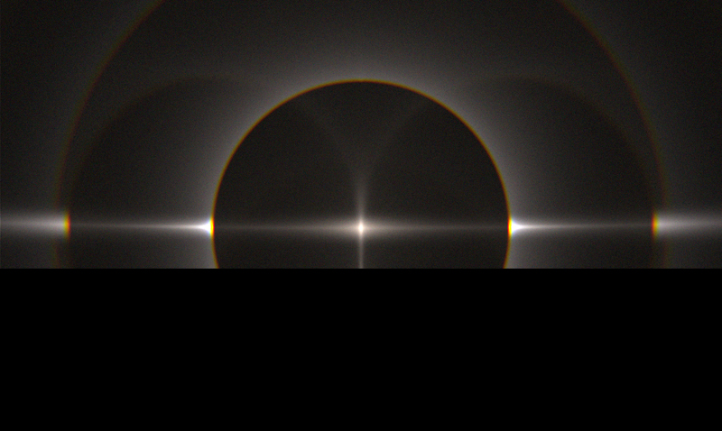

# Ice halo simulation program

## Introduction

This is a personal project for ice halo simulation. It is inspired by
[HaloPoint 2.0](https://www.ursa.fi/blogi/ice-crystal-halos/author/moriikon/) and
[HaloSim 3.0](https://www.atoptics.co.uk/halo/halfeat.htm). Unfortunately
the author of HaloPoint seems have stopped developing.

For a start this program is written in matlab though matlab is often poured scorn on for its
slow performance. It is a prototype, on which I test my algorithms. Later developing and
latest updates will be on C++ codes. Also, matlab codes contain some small tools for visualization.

Details including how to build and run can be found on following pages. *NOTE:* I've stopped developing
on matlab codes. These are just legacy codes remained here for reference.

* [C++ codes](cpp)  
* [Matlab codes](matlab)  

## Features

* High speed.  
  The simulation program is 50\~100 times faster than HaloPoint. On general cases
  this program runs at a speed of 140k\~200k rays per second. On multi-scattering cases
  it runs as faster as 50k\~80k rays per second. On the contrary, HaloPoint may cost minutes to
  render 100k rays, and even hours on multi-scattering cases. 
  
* Natural and vivid color.  
  Based on my another project [Spectrum Renderer](https://github.com/LoveDaisy/spec_render),
  a matlab tool to render colors with given spectrum, this simulation program can render
  very natural and vivid color.  
  
  
* Full multi-scattering support.  
  This program is designed to handle multi-scattering cases. As a reference, HaloPoint handles
  multi-scattering via a very tricky workaround, thus it is hard to simulate 
  [44-degree parhelia](https://www.atoptics.co.uk/halo/44pars.htm). And my program allows you
  to simulate any multi-scattering scenario freely. Following figure is generated in 23 minutes
  on my Macbook pro.
  
  
* Customized crystal model.
  This program has a simple built-in parser for [.obj file](https://en.wikipedia.org/wiki/Wavefront_.obj_file)
  and users can thus simulate with any complex crystal models, e.g. hollow hex-cylinder,
  created via 3D modeling software.

## Acknowledgements

1. [HaloPoint 2.0](https://www.ursa.fi/blogi/ice-crystal-halos/author/moriikon/) & 
[HaloSim 3.0](https://www.atoptics.co.uk/halo/halfeat.htm)
3. [Rapidjson](http://rapidjson.org/index.html)

# 冰晕模拟程序

## 简介

本项目是一个个人项目, 受到 [HaloPoint 2.0](https://www.ursa.fi/blogi/ice-crystal-halos/author/moriikon/) 和
[HaloSim 3.0](https://www.atoptics.co.uk/halo/halfeat.htm) 的启发.
但不幸的是 HaloPoint 原作者似乎停止更新了.

最开始我是从 matlab 代码开始的, 虽然 matlab 经常被人吐槽很慢, 但其实用于开发原型和验证算法来说足够了.
这个项目涉及大量的矩阵和向量计算, 恰恰是 matlab 擅长的.

在 matlab 代码上验证了算法后, 后续开发都将在 C++ 代码上进行. 此外 matlab 代码还包括了几个小工具, 用于一些可视化的任务.

关于构建和运行的细节, 请参见下面的页面. *注意:* matlab 代码我已不再开发, 这里保留仅作为参考.

* [C++ 代码](cpp/README_zh.md)  
* [Matlab 代码](matlab)  

## 功能特点

* 速度快  
  本模拟程序追踪光线效率非常优秀, 比 HaloPoint 快 50\~100 倍. 在多晶模拟的情况下, 比 HaloPoint 优势更大.
  对于一般情况, 本模拟程序模拟的速度约为每秒 14\~20 万光线, 在多晶的情况下约为 5\~8 万每秒. 相对的, 
  HaloPoint 模拟 10 万光线常常需要分钟级别的时间, 而多晶情况下更是需要好几个小时.
  
* 自然而鲜艳的色彩表现  
  本模拟程序的色彩模拟是基于我的另一个个人项目 [Spectrum Renderer](https://github.com/LoveDaisy/spec_render),
  那是一个 matlab 小工具, 可以对任意光谱所表现出来的颜色进行模拟.  
  
  
* 对多晶模拟的完整支持  
  本模拟程序可以完整地模拟多晶场景, 与普通单晶场景的操作没有区别, 不需特殊对待. 作为对比, HaloPoint 
  采用了一种非常绕的方式来勉强模拟多晶场景, 并且难以模拟 [44 度幻日](https://www.atoptics.co.uk/halo/44pars.htm).
  而本模拟程序可以让用户自由模拟任意的多晶场景. 下图所示场景只需要不到 23 分钟即可模拟渲染完.  
  
  
* 用户自定义的冰晶形状  
  本模拟程序实现了一个简单的 [.obj 文件](https://en.wikipedia.org/wiki/Wavefront_.obj_file) 解析器,
  因此支持用户通过 3D 建模软件自定义复杂形状的冰晶, 比如镂空的柱晶.

## 致谢

1. [HaloPoint 2.0](https://www.ursa.fi/blogi/ice-crystal-halos/author/moriikon/) & 
[HaloSim 3.0](https://www.atoptics.co.uk/halo/halfeat.htm)
3. [Rapidjson](http://rapidjson.org/index.html)

