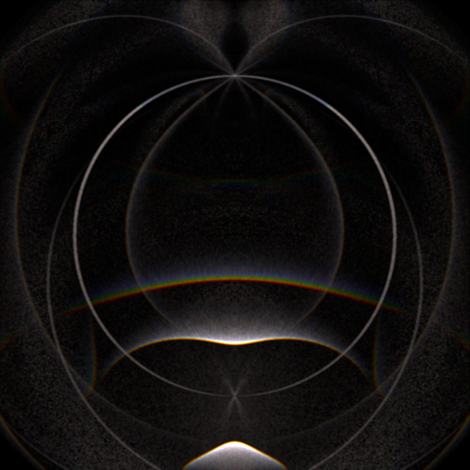

# Ice halo simulation program

This is a personal project for ice halo simulation. It is inspired by
[HaloPoint 2.0](https://www.ursa.fi/blogi/ice-crystal-halos/author/moriikon/). Unfortunately
the author seems have stopped developing.

For a start this program is written in matlab though matlab is often poured scorn on for its
slow performance. It is a prototype, on which I test my algorithms.

You can start from `matlab/ray_tracing_main.m`.

## Matlab version

### What can these codes do?

* It can do ray tracing with several specific ice crystal shape (see next section) and display the result.
* Arbitrary orientation of crystals, including uniform distributed in an angle range, uniform distributed on a sphere,
  Gaussian distributed with given mean and standard deviation.
* Multi-wave result visualization. It reads the binary file produced by C++ version and visulize the result. 
  It depends on my another project [Spectral Renderer](https://github.com/LoveDaisy/spec_render).

### Supported ice crystal shape.

* [Hexagonal cylinder/plate](https://www.atoptics.co.uk/halo/platcol.htm). 
  Shape parameters are: `ratio = height / radii`.
* [Pyramidal cylinder](https://www.atoptics.co.uk/halo/crystpyr.htm). 
  Shape parameters are: `ratios = [height1, height2, height3] / radii`, 
  where heights are measured along c-axis, from top to bottom.

### TODO list

* Add more crystal shapes.
* Add custom crystal shapes. Maybe compact with `.obj` file format.

## C++ version

Also I start a C++ project for higher performance. Currently the C++ version is just 
pieces of toy codes and can only run from command.

With integration of [Halide](http://halide-lang.org/) I can accelarate these codes by parallelism.

### TODO list

* Use OpenCL / OpenGL / CUDA to accelerate. Since I've seen good enough performance with integration of
  Halide, I doubt the margin to more acceleration.
* Write a GUI for these code.
