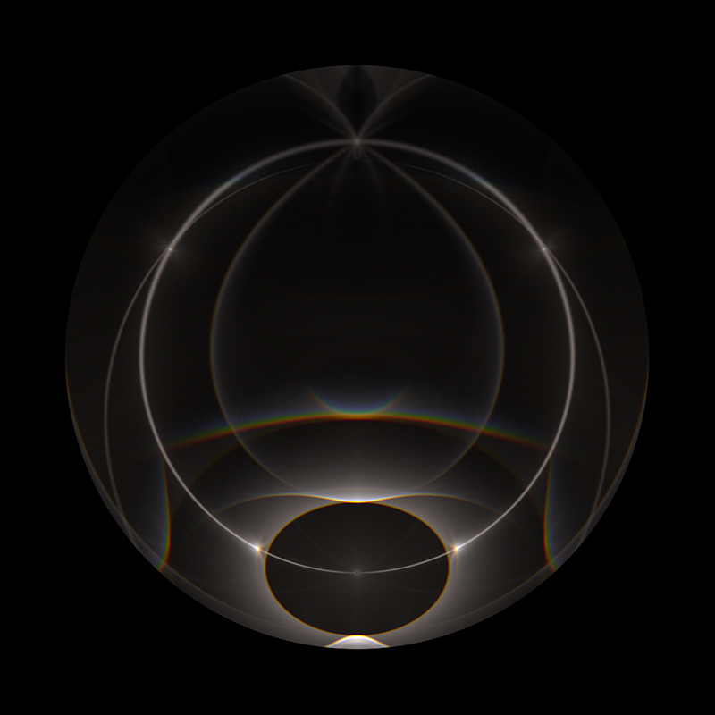

# Lumice

[中文版 / Chinese version](README_zh.md)

A simulation program for ice halo phenomena. It traces light rays interacting with ice crystals to reproduce various halo patterns. Fast and efficient, supporting natural color rendering and multiple scattering.

Inspired by [HaloPoint 2.0](https://www.ursa.fi/blogi/ice-crystal-halos/author/moriikon/) and
[HaloSim 3.0](https://www.atoptics.co.uk/halo/halfeat.htm).

## Features

* **High speed.**
  The simulation program is 50~100 times faster than HaloPoint. On general cases
  this program runs at a speed of 140k~200k rays per second. On multi-scattering cases
  it runs as fast as 50k~80k rays per second.

* **Natural and vivid color.**
  Based on the [Spectrum Renderer](https://github.com/LoveDaisy/spec_render) project,
  this simulation program can render very natural and vivid color.
  

* **Full multi-scattering support.**
  This program is designed to handle multi-scattering cases. It allows you
  to simulate any multi-scattering scenario freely. The following multi-scattering display
  is generated in 14 minutes with totally *72 million* starting rays traced.
  

* **Customized crystal model.** (not yet implemented)
  Support for custom crystal models via [.obj file](https://en.wikipedia.org/wiki/Wavefront_.obj_file)
  is planned but not yet re-implemented after the v3 rewrite. Currently only built-in
  crystal types (`prism` and `pyramid`) are available.

## Quick start

After cloning, you can run the build script to build and install it.

~~~bash
./scripts/build.sh -j release
~~~

If everything goes well, the executable will be installed into `build/cmake_install`. And
you can run it like:

~~~bash
./build/cmake_install/Lumice -f examples/config_example.json
~~~

It will output some information, as well as several rendered picture files.

If you are interested in more details, just go ahead to following sections.

## Getting started

### Prerequisites

- **CMake** >= 3.14
- **Ninja** (recommended, used as default build generator; install via `brew install ninja` on macOS or `apt install ninja-build` on Ubuntu)
- **C++17** compatible compiler (GCC, Clang, or MSVC)

All other dependencies are automatically downloaded and managed via [CPM.cmake](https://github.com/cpm-cmake/CPM.cmake):
- [nlohmann/json](https://github.com/nlohmann/json) v3.10.5 — JSON parsing (header-only)
- [spdlog](https://github.com/gabime/spdlog) v1.15.0 — Logging (header-only)
- [tl-expected](https://github.com/TartanLlama/expected) v1.1.0 — `expected<T,E>` for C++17 (header-only)
- [GoogleTest](https://github.com/google/googletest) v1.15.2 — Unit testing (downloaded when `-t` is enabled)

**GUI additional dependencies** (downloaded when `-g` is enabled):
- [Dear ImGui](https://github.com/ocornut/imgui) v1.91.8-docking — Immediate-mode GUI
- [GLFW](https://www.glfw.org/) 3.4 — Window and input
- [nfd](https://github.com/btzy/nativefiledialog-extended) v1.2.1 — Native file dialogs
- [imgui_test_engine](https://github.com/ocornut/imgui_test_engine) v1.91.8 — GUI automated testing (downloaded when `-g` and `-t` are both enabled)

> **Note on Ninja**: If Ninja is not installed, you can remove `-G Ninja` from `scripts/build.sh` to fall back to the system default generator (usually Unix Makefiles).

### Build project

A build script is provided to simplify the process.
With `-h` you will see help message:

~~~bash
./scripts/build.sh -h
Usage:
  ./scripts/build.sh [-tgbjksxh] <debug|release|minsizerel>
    Executables will be installed at build/cmake_install
OPTIONS:
  -t:          Build test cases and run test on them.
  -g:          Build GUI application (Dear ImGui + GLFW + OpenGL).
  -b:          Build benchmarks (Google Benchmark).
  -j:          Build in parallel, i.e. use make -j
  -k:          Clean build artifacts (keep dependency cache).
  -x:          Clean everything including dependency cache.
  -s:          Build shared library (default: static).
  -h:          Show this message.
~~~

Note that debug version executables will not be installed, so they will be found in `build/cmake_build`.

[GoogleTest](https://github.com/google/googletest) is used for unit tests.
If `-t` option is set, the test cases will be built and run.

### End-to-end tests

E2E tests run the built `Lumice` binary with test configurations and verify outputs.
They are independent of the CMake/CTest build and use Python `unittest`:

~~~bash
# Install test dependency
pip install Pillow

# Run all E2E tests
pytest test/e2e/ -v
~~~

See [`test/e2e/README.md`](test/e2e/README.md) for details.

### GUI application

A graphical interface is available for interactive simulation configuration and preview:

~~~bash
# Build the GUI application
./scripts/build.sh -gj release

# Run the GUI
./build/cmake_install/LumiceGUI
~~~

The GUI provides:
- Crystal parameter editing with real-time 3D preview
- Render settings with lens projection preview
- Filter and scene configuration
- Save/load project files (`.lmc` format)
- Run simulation and view results interactively

To build and run GUI automated tests (requires display server):

~~~bash
./scripts/build.sh -gtj release
~~~

> **Cross-platform note:** Core, CLI, and unit tests (`./scripts/build.sh -tj release`) contain no
> platform-specific code and should compile on any platform with a C++17 compiler. The GUI is
> built and tested on macOS, Linux, and Windows via CI. On macOS, the GUI is packaged as a native
> `.app` bundle with icon; on Windows, it runs as a standard `.exe` with embedded icon and no
> console window.

## Configuration file

Configuration file contains all settings for a simulation. It is written in JSON format,
parsed with [nlohmann/json](https://github.com/nlohmann/json).

An example configuration file is provided: `examples/config_example.json`.

For the complete configuration reference, see [Configuration Guide](doc/configuration.md).
Below is a brief overview of each section.

### Light source

The light source is defined inline within the `scene` object. Here is an example:

~~~json
"light_source": {
  "type": "sun",
  "altitude": 20.0,
  "azimuth": 0,
  "diameter": 0.5,
  "spectrum": "D65"
}
~~~

Fields `azimuth`, `altitude` describe position of the sun. They are in degrees, and so is `diameter`.

`spectrum` describes the spectrum of the light source. It can be either a standard illuminant name (e.g. `"D65"`) or an array of wavelength-weight objects. Wavelength determines refractive index, whose data is from
[Refractive Index of Crystals](https://refractiveindex.info/?shelf=3d&book=crystals&page=ice).

### Crystal

Here is an example for one element:

~~~json
"id": 3,
"type": "prism",
"shape": {
  "height": 1.3,
  "face_distance": [1, 1, 1, 1, 1, 1]
},
"axis": {
  "zenith": {
    "type": "gauss",
    "mean": 90,
    "std": 0.3
  },
  "roll": {
    "type": "uniform",
    "mean": 0,
    "std": 360
  },
  "azimuth": {
    "type": "uniform",
    "mean": 0,
    "std": 360
  }
}
~~~

A `crystal` section stores all crystals used in simulation. It may contain multiple elements (different crystals). They are referenced by `id`.

`zenith`, `roll` and `azimuth` (optional):
These fields define the pose of crystals. `zenith` defines the c-axis orientation, and `roll`
defines the rotation around c-axis.
They are of *distribution type*, which can be a scalar, indicating a deterministic distribution, or can be a tuple of (`type`, `mean`, `std`) describing a uniform or Gaussian distribution. All angles are in degrees.

`type` and `shape`: they describe the shape of a crystal.
Currently there are 2 kinds of crystals, `prism` and `pyramid`.
Each type has its own shape parameters.

  * `prism` (hexagonal prism):
  Parameter `height` defines `h / a` where `h` is the prism height, `a` is the diameter along
  a-axis (also x-axis in the program). It is of *distribution type*. Default: `1.0`.
  `face_distance` describes an irregular hexagonal face (see below). Default: `[1, 1, 1, 1, 1, 1]`.
  .

  * `pyramid` (hexagonal pyramid):
  `{upper|lower|prism}_h` describe heights of each segment, see picture below. `{upper|lower}_h` represent `h1 / H1` and `h3 / H3` respectively, where
  `H1` means the max possible height for upper pyramid segment, and `H3` the same but for lower pyramid segment. `prism_h` has the same meaning as for `prism`.
      .
  `{upper|lower}_indices` are
  [Miller index](https://en.wikipedia.org/wiki/Miller_index) describing the
  pyramidal face orientation. Default: `[1, 0, 1]`.

  * `face_distance`:
  The distance here means the ratio of actual face distance
  to a regular hexagon distance. A regular hexagon has distance of `[1, 1, 1, 1, 1, 1]`.
  The following figure shows an irregular hexagon with distance of `[1.1, 0.9, 1.5, 0.9, 1.7, 1.2]`
  .

### Filter

Here are two common examples:

~~~json
[
  {
    "id": 3,
    "type": "raypath",
    "raypath": [3, 5],
    "symmetry": "P"
  },
  {
    "id": 4,
    "type": "entry_exit",
    "entry": 3,
    "exit": 5,
    "action": "filter_in"
  }
]
~~~

`type`: can be one of these types: `raypath`, `entry_exit`, `direction`, `crystal`, `complex`, `none`.

### Scene

The `scene` is a single object (not an array) that defines the simulation parameters. Here is an example:

~~~json
"scene": {
  "light_source": {
    "type": "sun",
    "altitude": 20.0,
    "spectrum": "D65"
  },
  "ray_num": 1000000,
  "max_hits": 7,
  "scattering": [
    {
      "prob": 0.2,
      "entries": [
        {"crystal": 1, "proportion": 100},
        {"crystal": 2, "proportion": 30},
        {"crystal": 3}
      ]
    },
    {
      "entries": [
        {"crystal": 2, "proportion": 20, "filter": 2},
        {"crystal": 3, "proportion": 100, "filter": 1}
      ]
    }
  ]
}
~~~

`ray_num` can be an integer or `"infinite"` for unlimited rays.

### Render

Here is an example:

~~~json
"id": 3,
"lens": {
  "type": "linear",
  "fov": 40
},
"resolution": [1920, 1080],
"view": {
  "azimuth": -50,
  "elevation": 30,
  "roll": 0
},
"visible": "upper",
"background": [0, 0, 0],
"ray_color": [1, 1, 1],
"opacity": 0.8,
"grid": {
  "central": [
    {
      "value": 22,
      "color": [1, 1, 1],
      "opacity": 0.4,
      "width": 1.2
    }
  ],
  "elevation": [],
  "outline": true
}
~~~

`view`: describes camera pose.

`lens`: lens type, can be one of these values: `linear`, `fisheye_equal_area`, `fisheye_equidistant`, `fisheye_stereographic`, `dual_fisheye_equal_area`, `dual_fisheye_equidistant`, `dual_fisheye_stereographic`, `rectangular`.

You can use `fov` (field of view in degrees) or `f` (focal length in mm) to specify the lens. If `f` is used, the program automatically calculates the corresponding `fov`.

## Documentation

For detailed documentation, please refer to:
- [Documentation Index](doc/README.md) - Navigation and index of all documents
- [Configuration Guide](doc/configuration.md) - Complete configuration reference
- [Architecture Document](doc/architecture.md) - System architecture
- [Developer Guide](doc/developer-guide.md) - Developer guide
- [GUI Guide](doc/gui-guide.md) - GUI application usage
- [C API Documentation](doc/c_api.md) - C interface usage
- [API Documentation](doc/api/html/) - Auto-generated API docs (generate locally with `doxygen .doxygen-config`)

## Acknowledgements

1. [HaloPoint 2.0](https://www.ursa.fi/blogi/ice-crystal-halos/author/moriikon/) &
   [HaloSim 3.0](https://www.atoptics.co.uk/halo/halfeat.htm)
