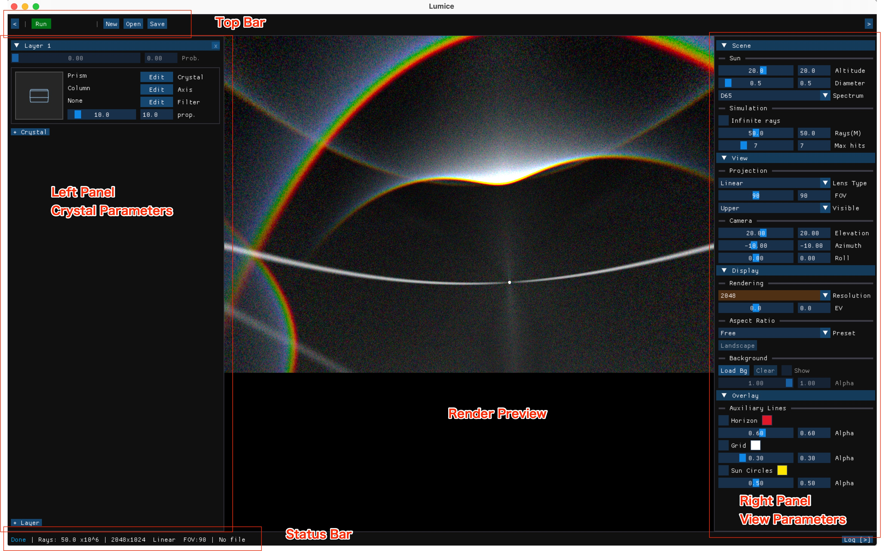

# Lumice

[中文版 / Chinese version](README_zh.md)

A C++17 ice halo ray-tracing simulator: it traces light rays through ice crystals to reproduce
natural halo patterns. Lumice is fast, supports natural spectral color rendering, and handles
arbitrary multi-scattering scenes. CLI and GUI front-ends share the same simulation core.

Inspired by [HaloPoint 2.0](https://www.ursa.fi/blogi/ice-crystal-halos/author/moriikon/) and
[HaloSim 3.0](https://www.atoptics.co.uk/halo/halfeat.htm).

## Features

* **High speed.** Roughly 50–100× faster than HaloPoint; 140k–200k rays/second on typical
  scenes, 50k–80k rays/second under multi-scattering.

* **Natural spectral color.** Wavelength-aware rendering powered by the
  [Spectrum Renderer](https://github.com/LoveDaisy/spec_render) project produces realistic
  halo color.

* **Multi-scattering support.** Arbitrary multi-scattering scenes (e.g. plate ice over
  randomly-oriented columns) are first-class — see the rendered 44° parhelia below.

  

## Quick start

Build the CLI and run the bundled example. Most readers should be up in five minutes.

~~~bash
# 1. Build (release, parallel) — installs into build/cmake_install/
./scripts/build.sh -j release

# 2. Run the example simulation
./build/cmake_install/Lumice -f examples/config_example.json
~~~

The CLI prints progress and writes four PNG/JPG renders next to your working directory.

> **Runtime.** The example traces 9-wavelength × 50 M rays. On a modern multi-core machine
> this takes roughly **2–10 minutes**; on a single-core or older laptop it can stretch to
> tens of minutes. To smoke-test much faster, set `"ray_num": 100000` in the config.

For an interactive workflow with live preview, see the GUI section below.

## Configuration file

Lumice reads a single JSON file describing the **crystal**, **filter**, **scene** (light
source + ray budget + scattering layers), and **render** (lens, view, resolution, grid)
sections. The example at [`examples/config_example.json`](examples/config_example.json) is
the canonical reference and is what the Quick start runs.

A minimal skeleton looks like:

~~~json
{
  "crystal": [ /* one or more crystal definitions, see configuration guide */ ],
  "filter":  [ /* optional ray-path filters */ ],
  "scene":   { "light_source": { /* sun/spectrum */ }, "ray_num": 50000000, "scattering": [ /* layers */ ] },
  "render":  [ { "lens": { "type": "fisheye_equal_area", "fov": 180 }, "resolution": [1920, 1080], /* ... */ } ]
}
~~~

For the full field reference (every section, every option, every lens type) see
[`doc/configuration.md`](doc/configuration.md).

## GUI overview

A graphical front-end (built with `./scripts/build.sh -gj release` and launched as
`./build/cmake_install/LumiceGUI`) lets you edit crystal/scene/render parameters with a
real-time 3D preview, cycle lens projections, and inspect simulation output without
hand-editing JSON.

The GUI panels cover crystal geometry & axis distributions, lens & view, filters,
multi-scattering layers, and project save/load (`.lmc`). Detailed walkthroughs of each
panel — including all lens projections, crystal preview modes, and editing dialogs —
live in [`doc/gui-guide.md`](doc/gui-guide.md).

## Documentation

| Document | Audience | What it covers |
|----------|----------|----------------|
| [Documentation index](doc/README.md) | All | Top-level navigation across docs |
| [Configuration guide](doc/configuration.md) | Users | Every JSON field, every lens type, every scattering option |
| [GUI guide](doc/gui-guide.md) | Users | Panel-by-panel walkthrough with screenshots |
| [Coordinate convention](doc/coordinate-convention.md) | Users / Authors | Rotation chain, axis sign convention, **v3 breaking change notes** |
| [Developer guide](doc/developer-guide.md) | Contributors | Build options, dependency list, build script reference, project layout |
| [Architecture](doc/architecture.md) | Contributors | Module layout, data flow, threading model |
| [C API](doc/c_api.md) | Integrators | Embedding Lumice via the C interface |
| [API reference](doc/api/html/) | Contributors | Doxygen-generated (run `doxygen .doxygen-config` locally) |

> Configurations from earlier releases may need to be re-authored: v3 reworked the rotation
> chain. See the breaking-change note at the top of `doc/coordinate-convention.md`.

## Acknowledgements

1. [HaloPoint 2.0](https://www.ursa.fi/blogi/ice-crystal-halos/author/moriikon/) &
   [HaloSim 3.0](https://www.atoptics.co.uk/halo/halfeat.htm)
