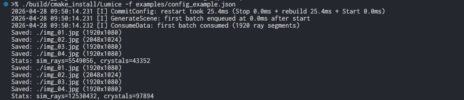
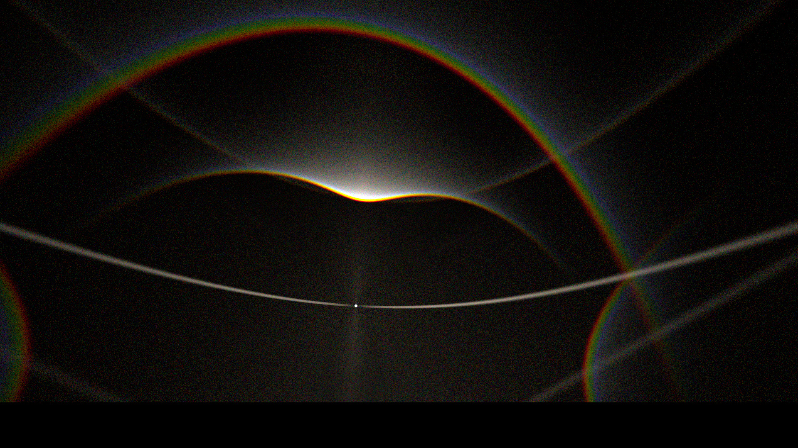
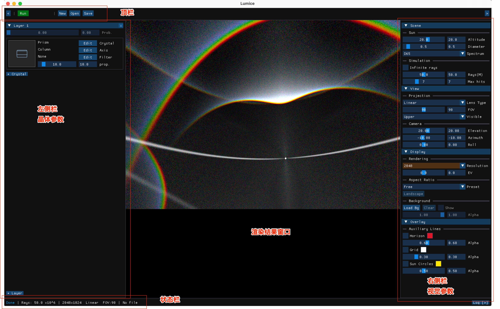

# Lumice

[English version](README.md)

C++17 编写的冰晕光线追踪模拟器：通过追踪光线在冰晶中的折射 / 反射来重现自然冰晕图样。
速度快、支持基于光谱的自然色彩渲染、原生支持任意多重散射场景。CLI 与 GUI 共享同一套
模拟内核。

灵感来自 [HaloPoint 2.0](https://www.ursa.fi/blogi/ice-crystal-halos/author/moriikon/) 与
[HaloSim 3.0](https://www.atoptics.co.uk/halo/halfeat.htm)。

## 功能特点

* **速度快。** 比 HaloPoint 快约 50–100 倍。一般场景每秒可追踪 14–20 万条光线，
  多重散射场景下每秒 5–8 万条。

* **自然光谱色彩。** 基于 [Spectrum Renderer](https://github.com/LoveDaisy/spec_render) 的
  波长感知渲染，可还原真实冰晕的色彩层次。

* **多重散射支持。** 任意多重散射场景（例如随机柱晶上方的板状冰晶层）皆为一等公民，
  下图为渲染得到的 44° 幻日。

  

## 快速开始

构建 CLI 并运行内置示例，多数读者 5 分钟即可上手。

~~~bash
# 1. 构建（release，多线程）—— 安装至 build/cmake_install/
./scripts/build.sh -j release

# 2. 运行示例模拟
./build/cmake_install/Lumice -f examples/config_example.json
~~~

CLI 会输出进度信息，并在工作目录写出 4 张渲染图。

> **运行时长。** 该示例追踪 9 段光谱 × 5 千万条光线。多核机器约 **2–10 分钟**；
> 单核或较老的笔记本可能延长到数十分钟。如仅做冒烟测试，可临时把配置中的
> `"ray_num"` 改为 `100000` 加速完成。

如需带实时预览的交互式工作流，参考下文 GUI 一节。

## 配置文件

Lumice 读取单个 JSON 文件，包含 **crystal**（晶体）、**filter**（光路过滤器）、
**scene**（光源 + 光线预算 + 多重散射层）以及 **render**（镜头、视角、分辨率、辅助网格）
四个区段。[`examples/config_example.json`](examples/config_example.json) 是规范参考，
也是上面 Quick start 实际运行的内容。

最简骨架如下：

~~~json
{
  "crystal": [ /* 一个或多个晶体定义，详见配置指南 */ ],
  "filter":  [ /* 可选的光路过滤器 */ ],
  "scene":   { "light_source": { /* 太阳 / 光谱 */ }, "ray_num": 50000000, "scattering": [ /* 散射层 */ ] },
  "render":  [ { "lens": { "type": "fisheye_equal_area", "fov": 180 }, "resolution": [1920, 1080], /* ... */ } ]
}
~~~

完整字段（每个区段、每种镜头、每个散射选项）见
[`doc/configuration.md`](doc/configuration.md)。

## GUI 概览

GUI 前端（`./scripts/build.sh -gj release` 构建，`./build/cmake_install/LumiceGUI` 启动）
让你在带实时 3D 预览的界面里编辑晶体 / 场景 / 渲染参数，切换镜头投影，并查看模拟产物，
不必手工编辑 JSON。

GUI 面板涵盖晶体几何与姿态分布、镜头与视角、光路过滤器、多重散射层、`.lmc` 项目保存
与加载等功能。每个面板（含所有镜头投影、晶体预览模式、编辑弹窗）的逐项说明位于
[`doc/gui-guide.md`](doc/gui-guide.md)。

## 文档

| 文档 | 目标读者 | 内容概括 |
|------|----------|----------|
| [文档索引](doc/README.md) | 所有人 | 文档总览与导航 |
| [配置指南](doc/configuration.md) | 用户 | 所有 JSON 字段、所有镜头类型、所有散射选项 |
| [GUI 使用指南](doc/gui-guide.md) | 用户 | GUI 各面板逐项说明（带截图） |
| [坐标约定](doc/coordinate-convention.md) | 用户 / 配置作者 | 旋转链与轴向符号约定，**v3 破坏性变更说明** |
| [开发者指南](doc/developer-guide.md) | 贡献者 | 构建选项、依赖列表、构建脚本参考、项目结构 |
| [架构文档](doc/architecture.md) | 贡献者 | 模块布局、数据流、线程模型 |
| [C API 文档](doc/c_api.md) | 集成方 | 通过 C 接口嵌入 Lumice |
| [API 参考](doc/api/html/) | 贡献者 | Doxygen 自动生成（本地运行 `doxygen .doxygen-config`） |

> 旧版本的配置可能需要重写：v3 重构了旋转链。详见 `doc/coordinate-convention.md`
> 顶部的破坏性变更说明。

## 致谢

1. [HaloPoint 2.0](https://www.ursa.fi/blogi/ice-crystal-halos/author/moriikon/) 与
   [HaloSim 3.0](https://www.atoptics.co.uk/halo/halfeat.htm)
