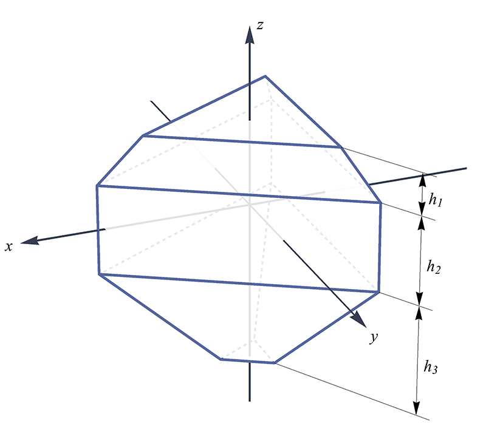

# C++ codes

[中文版说明](README_zh.md)

After testing my algorithms on matlab codes, I start a C++ project for higher performance. Currently the C++ version 
can only run from command, no GUI.

## Build and run

Requires: Boost (>= 1.54), OpenCV (>= 3.3). Has been tested on Mac OSX 10.13 and Ubuntu 14.04.

This C++ project is built with [CMake](https://cmake.org/).
A simple way to build form start is as follows:

0. `git clone --recursive https://github.com/LoveDaisy/ice_halo_sim.git`
1. `cd ice_halo_sim/cpp`
2. `mkdir build && cd build`
3. `cmake .. && make -j4`, or you can set `CMAKE_BUILD_TYPE` to `release` to get highest performance. 

Then the executable binary will be at `build/bin`. And you can start by
`./bin/IceHaloSim <config-file>`. The file [`config-example.json`](./config-example.json) 
is an example configuration file.

## Visualization

After building and running, you will get several `.bin` files that contain results of ray tracing,
as well as several lines printed on the screen that describe crystal shapes.
I have prepared several tools for visualization those results. Some are matlab codes.

* Halo picture.  
There is a matlab tool for generating halo picture.
Script `matlab/src/read_binary_result-example.m` reads the `.bin` files and plot the ray tracing result.
See [matlab](../matlab/) folder for details. 

  And there is also a C++ tool does the same thing. Please run 
`./bin/IceHaloRender <config-file>` for visualization. 
Just use the same configuration file as you run the simulation. I'd prefer this C++ tool
than the matlab tool because it is much faster.

* Crystals  
Script `matlab/src/plot_crystal-example.m` plots the shape of crystals. You can copy data from program output on
screen. The lines start with `V:` indicate vertex data, and those start with `F:` indicate face data.
See [matlab](../matlab/) folder for details.

## Configuration file

This file containing all configurations. It uses JSON format. 
I choose [Rapidjson](http://rapidjson.org/index.html) to parse JSON file.

### Basic infomation for simulation

* `sun`:
It has two attributes, 
  * `altitude`, defining the altitude of the sun.  
  * `diameter`, defining the actual diameter used in the simulation, in degree. Please set to 0.5 for ture sun.

* `ray`:
It defines some properties of rays used in simulation,
  * `number`, the total ray number for simulation. 
    Note that even with a single incident ray, it may result in multiple
    rays output, due to reflections and refractions in crystal. This `number` defines the input ray number,
    but not output ray number.
  * `wavelength`, the wavelengths used during simulation.
    It is an array contains all wavelengths you want to use. The refractive index data is from
    [Refractive Index of Crystals](https://refractiveindex.info/?shelf=3d&book=crystals&page=ice).

* `max_recursion`:
It defines the max number that a ray hits a surface during a simulation. If a ray hits more than this number
and still doesn't leave the crystal, it will be dropped.

* `multi_scatter`:
It defines how to simulate multi-scattering halos. It has two attributes,
  * `repeat`, defining how many times ray pass through crystals. If it is set to 1, then the simulation
    goes without any multi-scattering effects. In most cases, it is enough to set to 2. *NOTE:* simulation
    speed drammatically slow down when `repeat` increases.   
  * `probability`, defining how many rays can pass through next crystal. If it is set to 1.0, then
    *ALL* rays will be used as input for next crystal.
    
  Multi-scattering is a highlight feature of this project. As far as I know, HaloSim cannot do this kind simulation.
While HaloPoint handles it by a tricky workaround, and implements for only limited scenarios.

* `data_folder`:
It defines where output data files should be located. The simulation program will put data into this
folder and the rendering program will read data from this folder. Also the rendered image will be put
in this folder.

### Rendering settings

* `camera`:
It defines properties related to camera, including:  
  * `azimuth`, `elevation`, `rotation`: the direction where camera pointing at. In degree.
  * `fov`: (half) field of view, the angle from center to edge. In degree.
  * `width`, `height`: the size of output image. In pixel.
  * `lens`: lens type, can be one of `fisheye` or `linear`.
  
* `render`:
It defines some useful attributes used when rendering:
  * `visible_semi_sphere`, which semi-sphere should be rendered. Its default value is `uppper`,
    indicating the upper semi sphere should be rendered, which is the common scene. If it is set to `lower`, then
    halos that occure under horizontal, say, [subparhilia](https://www.atoptics.co.uk/halo/subpars.htm), 
    will be rendered as well. The values could be one of these: `upper`, `lower`, `camera`, `full`.
  * `intensity_factor`, controls the intensity. The value locates between 0.1 and 10.0.
  * `offset`, defines the rendering offset. In pixel.
  * `ray_color`, defines the color used to plot the ray scatter points. It
    can be a 3-element array defining the RGB color, or can be a string `real` indicating
    to use real colors. NOTE: RGB value must between 0.0 and 1.0.  
    Real-color is also a highlighted feature of this project.
  * `background_color`, defines the RGB color used for background. Each element must be between 0.0 and 1.0.

### Crystal settings

* `axis` and `roll`:
These two fields defines the orientation of crystals. `axis` defines the c-axis orientation, and `roll`
defines the rotation around c-axis (also regarded as z-axis in above figures and my program).

  These fields all has three attributes, `mean`, `std`, `type`.  
  `type` defines the random distribution
type, either `Gauss`, for Gaussian distribution, or `Uniform`, for uniform distribution. *NOTE:*
if `type` of `axis` is set to `Uniform`, then `mean` and `std` will be ignored and
the axis will uniformly distributed on sphere. (This could be changed in the future)  
  `mean` defines
the mean of the random distribution. For `axis`, it means the zenith angle.  
  `std` defines the deviation of the distribution. For Gaussian distribution,
it is the standard deviation, and for uniform distribution, it defines the value range.

  All angles are in degrees.

* `population`:
It defines how many crystals used in a simulation. Note that it is not the actual number, just for a
ratio. So if one crystal set to 2.0 and the other set to 3.0, it is equivalent to set one to 20 and
the other to 30.

* `type` and `parameter`:
Currently I create 5 shapes, `HexCylinder`, `HexPyramid`, `HexPyramidStackHalf`, `TriPyramid`, `CubicPyramid`,
`Custom`.
Each shape has its own shape parameters.

  * `HexCylinder`:
  Only 1 parameter, defines `h / a` where `h` is the cylinder height, `a` is the diameter along
  a-axis (also x-axis in my program).  
  .

  * `HexPyramid`:
  May have 3, 5, or 7 parameters.  
    * For 3 parameters case, they are `h1 / H1`, `h2 / a`, `h3 / H3` respectly,
      where `H1` means the max possible height for pyramid segment, and `H3` the same.  
      .  
    * For 5 parameters case, the last 3 parameters are same as the first case,
      and the first 2 parameters indicate the face direction. They must be integers. The
      face direction is described with [Miller index](https://en.wikipedia.org/wiki/Miller_index).
      For example, `a`, `b`, represents a face with Miller index of (`a`, 0, `-a`, `b`). For a
      typical ice crystal face (face number 13), its Miller index is (1, 0, -1, 1).
      So it can be described using parameters 1, 1.  
    * For 7 parameters case, the first 4 parameters are interges and describe the upper and lower pyramid segment
      face directions. For example `a`, `b`, `c`, `d` describe upper pyramid segment with Miller index of
      (`a`, 0, `-a`, `b`) and lower pyramid segment of (`c`, 0, `-c`, `d`). NOTE: for faces with different
      Miller index, their maximumn height `H` are also different. 
      
    With these description, you will have the maximized freedom to design your crystal shape.

  * `HexPyramidStackHalf`:
  7 parameters. Similar to 7 parameters `HexPyramid` case. `h / H` for pyramid segment, and `h / a`
  for cylinder segment.  
  . 

  * `TriPyramid`:
  5 parameters. Similar to 5 parameter case of `HexPyramid`. (TODO: 3 and 7 parameters cases to be added.)  
  . 

  * `CubicPyramid`:
  2 parameters. Similar to cases above, the 2 parameters defines `h1 / H1` and `h2 / H2`.  
  NOTE: this kind crystal has cubic system.  
   

  * `Custom`:
  1 parameters that indicates the model file name.  
  Customized crystal type supports
  [Wavefront obj file](https://www.wikiwand.com/en/Wavefront_.obj_file) format. It is an ASCII based
  3D model file format, which means it is human read-frendly and you can open and edit the model file
  with any text editor. Of course it is a better and elegent way to create your crystal in
  a 3D modeling software, such as Maya, 3DMax, Blender, etc.  
  *NOTE:* Though the obj file can contain polygons having more than 3 vertexes, my program
  can only handle triangles. A face is only represented with its first 3 vertexes (if you set more than 3).
  Currently my program cannot handle vertex texture nor vertex normal information. Please make sure your
  obj file does not contain any of them (the face line does not contain any slashes).  
  All your models should be put in a folder named `models` and this folder must put at the same place
  where configuration file locates. Otherwise my program cannot find them.

## TODO list

* Use OpenCL / OpenGL / CUDA to accelerate. Since I've seen good enough performance with a simple
  threading pool implemented by myself, I doubt the margin to more improvements.
* Add more convenient crystal models, e.g. exotic hex-cylinder/pyramid crystals.
* Write a (web) GUI for these code.
