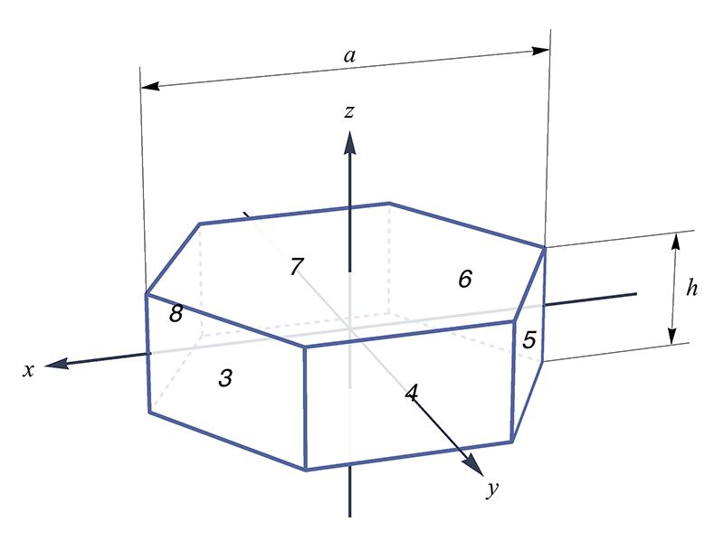
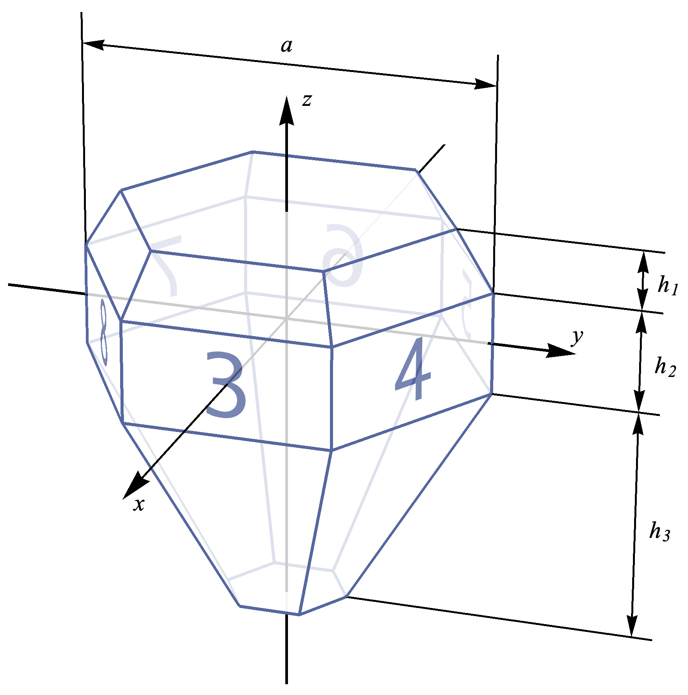

# C++ version

[中文版](README_zh.md)

Besides matlab codes, I start a C++ project for higher performance. Currently the C++ version is just 
pieces of toy codes and can only run from command, no GUI.

With integration of [Halide](http://halide-lang.org/) I can accelarate these codes by parallelism.

## Build and run

This C++ project is built with [CMake](https://cmake.org/). A simple way to build form start is as follows:

1. `cd cpp`
2. `mkdir build && cd build`
3. `cmake .. && make -j4`, or you can set `CMAKE_BUILD_TYPE` to `release` to get highest performance.

Then the executable binary will be at `build/bin`. And you can start by 
`./bin/IceHaloSim <path-to-your-config-file>`. The file [`cpp/config.json`](./config.json) is an example configuration file.

## Configuration file

It is file containing all configurations. It uses JSON format. It must containts `sun`, `ray_number`,
`max_recursion`, `crystal` fields.

### Basic infomation for simulation

* `sun`:
It only contains one attribute, `altitude`, defining the altitude of the sun.

* `ray_number`:
The total ray number for simulation. Note that even with a single ray input, it may result in multiple
rays output, due to reflections and refractions in crystal. This `ray_number` defines the input ray number,
but not output ray number.

* `max_recursion`:
It defines the max number that a ray hits a surface during a simulation. If a ray hits more than this number
and still doesn't leave the crystal, it will be dropped.

### Crystal settings

* `type` and `parameter`:
Currently I create 5 shapes, `HexCylinder`, `HexPyramid`, `HexPyramidStackHalf`, `TriPyramid`, `CubicPyramid`.
Each shape has its own shape parameters.

  * `HexCylinder`:
  Only 1 parameter, defines `h / a` where `h` is the cylinder height, `a` is the diameter along
  a-axis (also x-axis in my program).  
  .
  
  * `HexPyramid`:
  May have 3, 5, or 7 parameters.  
  For 3 parameters case, they are `h1 / H1`, `h2 / a`, `h3 / H3` respectly,
  where `H1` means the max possible height for pyramid segment, and `H3` the same.  
  .  
  For 5 parameters case, the last 3 parameters are same as the first case, 
  and the first 2 parameters indicate the face direction. They must be integers. The
  face direction is described with [Miller index](https://en.wikipedia.org/wiki/Miller_index).
  For example, `a`, `b`, represents a face with Miller index of (`a`, 0, `-a`, `b`). For a
  typical ice crystal face (face number 3 as shown in the figure), its Miller index is (1, 0, -1, 1).
  So it can be described using parameters 1, 1.  
  For 7 parameters case, the first 4 parameters are interges and describe the upper and lower pyramid segment
  face directions. For example `a`, `b`, `c`, `d` describe upper pyramid segment with Miller index of
  (`a`, 0, `-a`, `b`) and lower pyramid segment of (`c`, 0, `-c`, `d`).  
  With these description, you will have the maximized freedom to design your crystal shape.
  
  * `HexPyramidStackHalf`:
  7 parameters. Similar to 7 parameters `HexPyramid` case. `h / H` for pyramid segment, and `h / a`
  for cylinder segment.  
  . 
  
  * `TriPyramid`:
  5 parameters.
  * `CubicPyramid`:
  2 parameters.

* `axis` and `roll`:
These two fields defines the orientation of crystals. `axis` defines the c-axis orientation, and `roll`
defines the rotation around c-axis.

  These fields all has three attributes, `mean`, `std`, `type`. `type` defines the random distribution
type, either `Gauss`, for Gaussian distribution, or `Uniform`, for uniform distribution. `mean` defines
the mean of the random distribution. For `axis`, it means the zenith angle. 
`std` defines the deviation of the distribution. For Gaussian distribution,
it is the standard deviation, and for uniform distribution, it defines the value range.

  All angles are in degrees.

* `population`:
It defines how many crystals used in a simulation. Note that it is not the actual number, just for a
ratio. So if one crystal set to 2.0 and the other set to 3.0, it is equivalent to set one to 20 and
the other to 30.

## TODO list

* Use OpenCL / OpenGL / CUDA to accelerate. Since I've seen good enough performance with integration of
  Halide, I doubt the margin to more acceleration.
* Write a GUI for these code.
