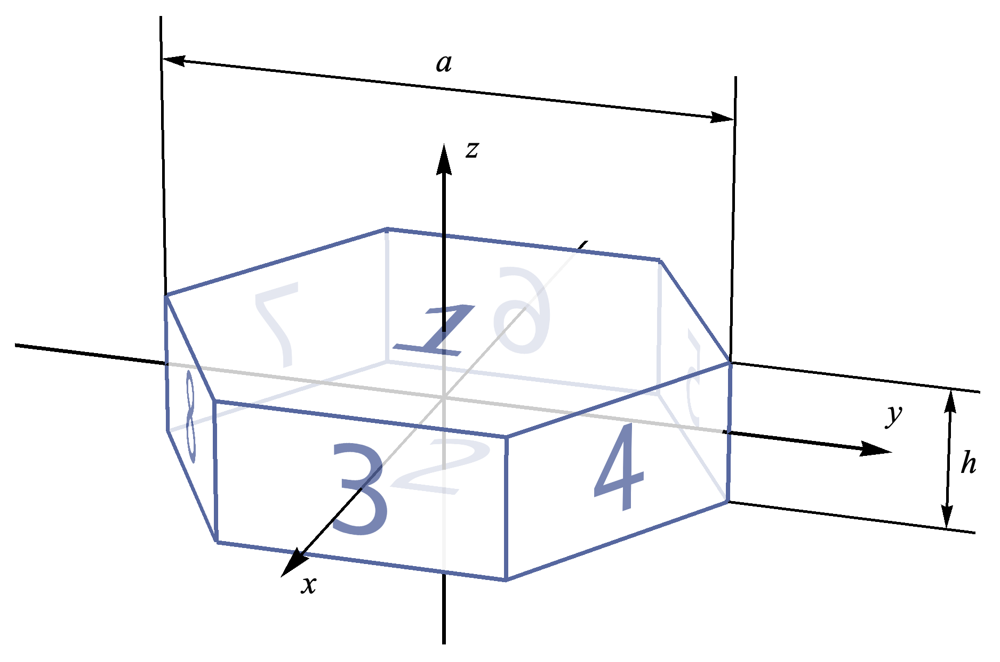
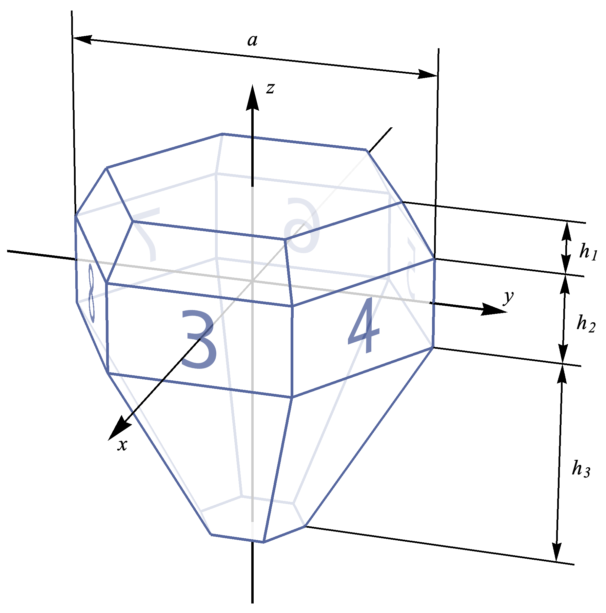
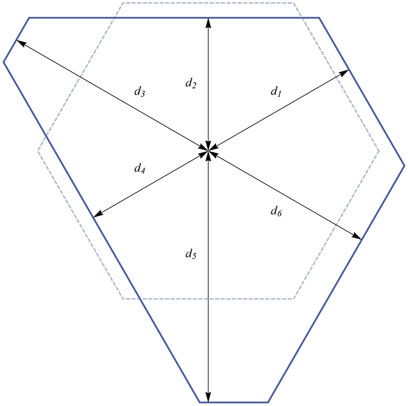

# C++ 代码

[English version](README.md)

这是一个冰晕模拟程序，通过追踪光线与冰晶的交互来再现各种冰晕现象。速度快且高效，支持自然色彩渲染、多次散射以及自定义冰晶模型（.obj 格式）。

## 快速开始

克隆项目后，可以运行构建脚本来构建和安装：

~~~bash
cd cpp
./build.sh -j release
~~~

如果一切顺利，可执行文件将安装到 `build/cmake_install`。然后可以这样运行：

~~~bash
./build/cmake_install/IceHalo -f config_example.json
~~~

程序将输出一些信息，以及几张渲染的图片文件。

如果你需要更多详细信息，请继续阅读下面的章节。

## 开始使用

### 前置要求

- **CMake** >= 3.14
- **Ninja**（推荐，用作默认构建生成器；macOS: `brew install ninja`，Ubuntu: `apt install ninja-build`）
- **C++17** 兼容编译器（GCC、Clang 或 MSVC）

所有其他依赖通过 [CPM.cmake](https://github.com/cpm-cmake/CPM.cmake) 自动下载和管理：
- [nlohmann/json](https://github.com/nlohmann/json) v3.10.5 — JSON 解析（header-only）
- [spdlog](https://github.com/gabime/spdlog) v1.15.0 — 日志（header-only）
- [tl-expected](https://github.com/TartanLlama/expected) v1.1.0 — C++17 `expected<T,E>`（header-only）
- [GoogleTest](https://github.com/google/googletest) v1.15.2 — 单元测试（启用 `-t` 时下载）

> **关于 Ninja**: 若未安装 Ninja，可将 `build.sh` 中的 `-G Ninja` 删除，CMake 将回退到系统默认生成器（通常为 Unix Makefiles）。

### 构建项目

提供了一个构建脚本来简化操作。
使用 `-h` 可以看到帮助信息：

~~~bash
./build.sh -h
Usage:
  ./build.sh [-tjksh] <debug|release|minsizerel>
    Executables will be installed at build/cmake_install
OPTIONS:
  -t:          Build test cases and run test on them.
  -j:          Build in parallel, i.e. use make -j
  -k:          Clean temporary building files.
  -s:          Build shared library (default: static).
  -h:          Show this message.
~~~

注意，debug 版本的可执行文件不会被安装，它们位于 `build/cmake_build`。

使用 [GoogleTest](https://github.com/google/googletest) 框架进行单元测试。
如果设置了 `-t` 选项，测试用例将被构建并运行。

## 配置文件

配置文件包含模拟的所有设置。使用 JSON 格式编写，由 [nlohmann/json](https://github.com/nlohmann/json) 解析。

示例配置文件：`config_example.json`。

完整配置参考请查看 [配置文档](doc/configuration.md)。以下是各节的简要概述。

### 光源

以下是一个元素的示例：

~~~json
"id": 2,
"type": "sun",
"altitude": 20.0,
"azimuth": 0,
"diameter": 0.5,
"wavelength": [ 420, 460, 500, 540, 580, 620 ],
"wl_weight": [ 1.0, 1.0, 1.0, 1.0, 1.0, 1.0 ]
~~~

`light_source` 节描述光源的属性。它可以包含多个元素，对应多个光源。它们通过 `id` 引用。
ID 应该是大于 0 的唯一数字。ID 不必连续递增。

字段 `azimuth`、`altitude` 描述太阳的位置。它们以度为单位，`diameter` 也是如此。

`wavelength` 和 `wl_weight` 描述光源的光谱。
它们是数组，包含你想要在模拟中使用的所有波长。波长决定折射率，其数据来自
[Refractive Index of Crystals](https://refractiveindex.info/?shelf=3d&book=crystals&page=ice)。

### 晶体

以下是一个元素的示例：

~~~json
"id": 3,
"type": "prism",
"shape": {
  "height": 1.3,
  "face_distance": [1, 1, 1, 1, 1, 1]
},
"axis": {
  "zenith": {
    "type": "gauss",
    "mean": 90,
    "std": 0.3
  },
  "roll": {
    "type": "uniform",
    "mean": 0,
    "std": 360
  },
  "azimuth": {
    "type": "uniform",
    "mean": 0,
    "std": 360
  }
}
~~~

`crystal` 节存储模拟中使用的所有晶体。它可以包含多个元素（不同的晶体）。它们通过 `id` 引用。

`zenith`、`roll` 和 `azimuth`（可选）：
这些字段定义晶体的姿态。`zenith` 定义 c 轴方向，`roll` 定义绕 c 轴的旋转。
它们是*分布类型*，可以是标量（表示确定性分布），也可以是元组 (`type`, `mean`, `std`) 描述均匀分布或高斯分布。所有角度都以度为单位。

`type` 和 `shape`：它们描述晶体的形状。
目前有两种晶体类型：`prism`（六棱柱）和 `pyramid`（六棱锥）。
每种类型都有自己的形状参数。

  * `prism`（六棱柱）：
    参数 `height`，定义为 `h / a`，其中 `h` 是棱柱高度，`a` 是沿 a 轴的直径。它是*分布类型*。默认值：`1.0`。
    `face_distance` 描述不规则六边形面（见下方）。默认值：`[1, 1, 1, 1, 1, 1]`。
    .

  * `pyramid`（六棱锥）：
    `{upper|lower|prism}_h` 描述各段的高度，见下图。`{upper|lower}_h` 分别表示 `h1 / H1` 和 `h3 / H3`，其中 `H1` 表示上锥段的最大可能高度，`H3` 类似。`prism_h` 是柱体段的高度比 h/a。
    .
    `{upper|lower}_indices` 是 [Miller index](https://en.wikipedia.org/wiki/Miller_index) 描述锥面的方向。默认值：`[1, 0, 1]`。

  * `face_distance`：
    这里的距离表示实际面距离与正六边形距离的比值。正六边形的距离为 `[1, 1, 1, 1, 1, 1]`。
    下图显示了一个不规则六边形，距离为 `[1.1, 0.9, 1.5, 0.9, 1.7, 1.2]`
    .

### 过滤器

以下是两个常见示例：

~~~json
[
  {
    "id": 3,
    "type": "raypath",
    "raypath": [3, 5],
    "symmetry": "P"
  },
  {
    "id": 4,
    "type": "entry_exit",
    "entry": 3,
    "exit": 5,
    "action": "filter_in"
  }
]
~~~

`type`：可以是以下类型之一：`raypath`、`entry_exit`、`direction`、`crystal`、`complex`、`none`。

### 场景

以下是一个示例：

~~~json
"id": 3,
"light_source": 2,
"ray_num": 1000000,
"max_hits": 7,
"scattering": [
  {
    "crystal": [1, 2, 3],
    "prob": 0.2
  },
  {
    "crystal": [2, 3],
    "proportion": [20, 100],
    "filter": [2, 1]
  }
]
~~~

### 渲染

以下是一个示例：

~~~json
"id": 3,
"lens": {
  "type": "linear",
  "fov": 40
},
"resolution": [1920, 1080],
"view": {
  "azimuth": -50,
  "elevation": 30,
  "roll": 0,
  "distance": 8
},
"visible": "upper",
"background": [0, 0, 0],
"ray": [1, 1, 1],
"opacity": 0.8,
"grid": {
  "central": [
    {
      "value": 22,
      "color": [1, 1, 1],
      "opacity": 0.4,
      "width": 1.2
    }
  ],
  "elevation": [],
  "outline": true
}
~~~

`view`：描述相机姿态。

`lens`：镜头类型，可以是以下值之一：`linear`、`fisheye_equal_area`、`fisheye_equidistant`、`fisheye_stereographic`、`dual_fisheye_equal_area`、`dual_fisheye_equidistant`、`dual_fisheye_stereographic`、`rectangular`。

可以使用 `fov`（视场角，度）或 `f`（焦距，mm）来指定。如果使用 `f`，程序会自动计算对应的 `fov`。

### 项目

没什么复杂的。它只是保持对场景和渲染器的引用。

## 文档导航

- [文档索引](doc/README.md) - 所有文档的导航和索引
- [配置文档](doc/configuration.md) - 完整配置参考
- [系统架构文档](doc/architecture.md) - 系统架构设计
- [开发指南](doc/developer-guide.md) - 开发指南
- [C 接口文档](doc/c_api.md) - C 接口使用说明
- [API 文档](doc/api/html/) - 自动生成的 API 文档（需要本地生成：`doxygen .doxygen-config`）
