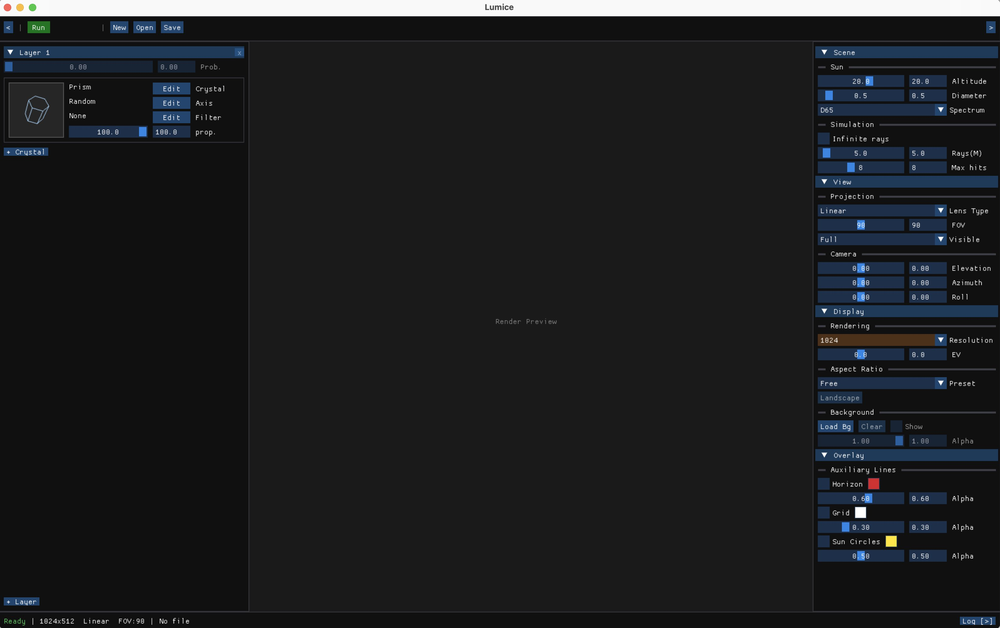
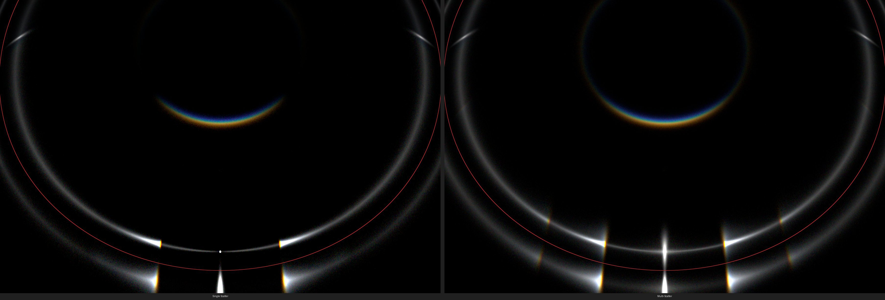
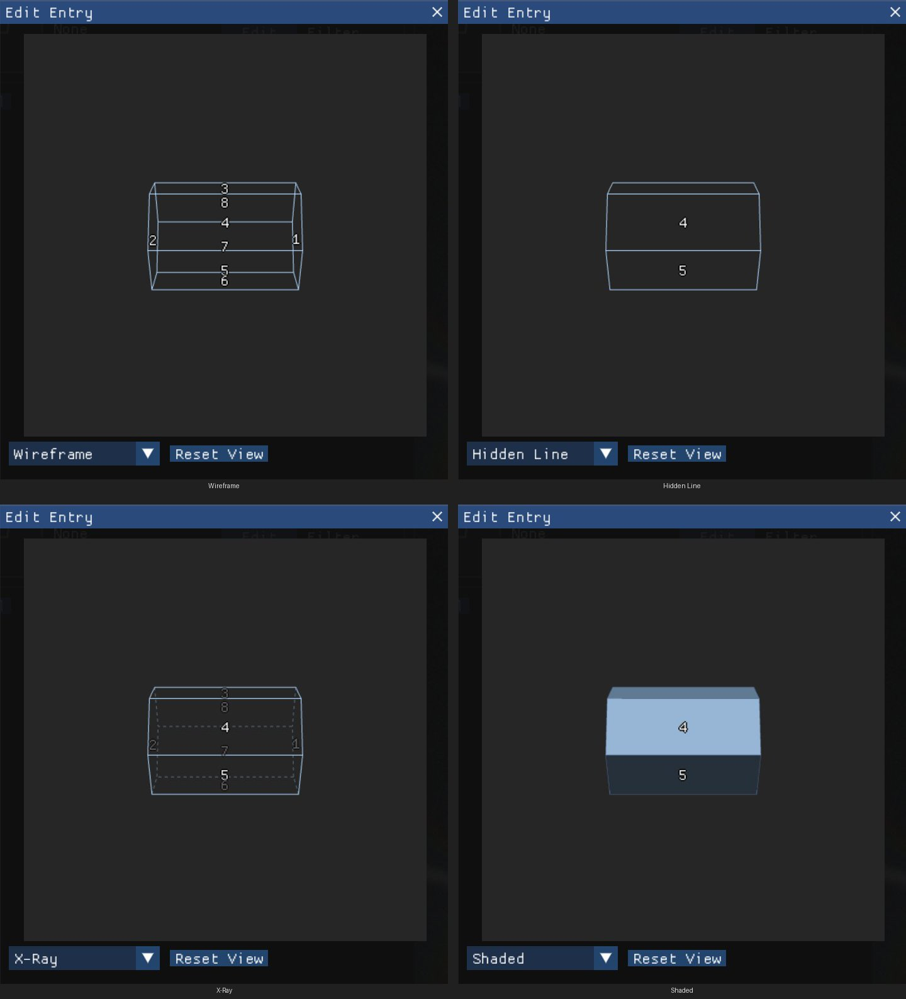
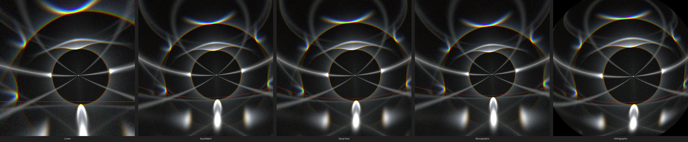
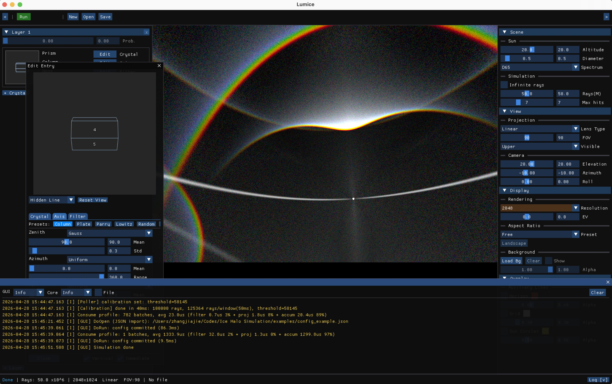
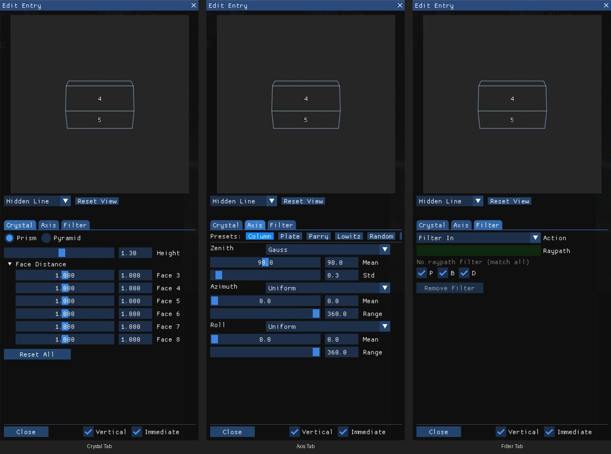

[中文版](gui-guide_zh.md)

# GUI Guide

This document describes the Lumice GUI application — an interactive graphical interface for configuring and previewing ice halo simulations.

## Building and Running

```bash
# Build the GUI application
./scripts/build.sh -gj release

# Run
./build/cmake_install/LumiceGUI
```

The GUI requires a display server and a GPU with OpenGL 3.2 Core Profile support.

## UI Layout

The main window is split into six regions. The same numbering is used in the labels below and in the rest of this document.



| # | Region | Purpose |
|---|--------|---------|
| 1 | Top Bar | File operations (New / Open / Save), simulation Run / Stop / Revert, panel collapse toggles |
| 2 | Left Panel — Crystal Parameters | Scattering layers and the crystal cards inside each layer (geometry / axis / filter / proportion) |
| 3 | Right Panel — View Parameters | Scene (Sun + Simulation), View (Projection + Camera), Display (Resolution / EV / Aspect / Background), Overlay |
| 4 | Render Preview | The lens-projected halo image accumulated as rays land |
| 5 | Status Bar | Simulation state badge, ray count, current resolution / lens / FOV, file name, log toggle |
| 6 | Popup Editor | Modal editor opened from a crystal card; edits Crystal / Axis / Filter in three tabs |

The left and right side panels can be collapsed independently — useful when you want a wider Render Preview during simulation.

## Top Bar

From left to right, the Top Bar exposes:

- **Left panel collapse**: `<` collapses the left panel; `>` expands it again (also bound to the `[` key).
- **Run / Stop**: a single fixed-width button that toggles between green **Run** and red **Stop** depending on the simulation state. Disabled controls during a running simulation are re-enabled once the run finishes.
- **Revert**: appears only after parameters have been changed since the last simulation finished (status `Modified`); restores the configuration that produced the last result.
- **New / Open**: project lifecycle actions (disabled while simulating).
- **Save**: opens a popup menu containing:
  - `Save` / `Save Copy` — write the project as a `.lmc` file
  - `Screenshot...` — export the current Render Preview as PNG
  - `Dual Fisheye Equal Area...` / `Equirectangular...` — server-side off-screen exports (require a finished simulation)
  - `Config JSON...` — export the configuration in JSON form
  - `Include Texture in .lmc` / `Include Overlay in Screenshot` — toggles for the next save / screenshot
- **Right panel collapse**: `<` / `>` mirror the left toggle (also bound to the `]` key).

## Left Panel — Crystal Parameters

### Layer & Crystal Cards

The left panel holds one or more **scattering layers**, each containing one or more **crystal cards**. Layers stack from top to bottom; rays exit the previous layer and enter the next with the layer's `Prob.` value (disabled when there is only one layer).



Each crystal card reflects one entry in the scattering layer:

- **Thumbnail** (left): a small 3D preview of the crystal geometry; the cache repaints when geometry or axis settings change.
- **Crystal row**: type (`Prism` / `Pyramid`) + an `Edit` button that opens the Popup Editor on the Crystal tab.
- **Axis row**: a named preset describing the axis distribution (`Parry` / `Column` / `Lowitz` / `Plate` / `Random` / `Custom`) + `Edit` opens the Axis tab.
- **Filter row**: a one-line summary of the ray-path filter + `Edit` opens the Filter tab.
- **Proportion slider** (`prop.`): how this entry is weighted within the layer (0 – 100).

The thumbnail can be drawn in four render styles. The style selector lives in the Popup Editor's persistent left preview pane (shared across the Crystal / Axis / Filter tabs) — see the [Popup Editor](#popup-editor) section.



The bottom of each layer carries a `+ Crystal` button (add another entry) and the layer header carries a right-aligned `x` (delete the layer; disabled when only one layer remains). A bottom-of-panel `+ Layer` button adds a new scattering layer.

### Card Hover Actions

Hovering a crystal card reveals two small action buttons in its top-right corner:

- `D` — duplicate the entry into the same layer (deep copy of crystal / axis / filter / proportion).
- `×` — delete the entry. Coloured red and disabled when the layer would otherwise be empty.

The buttons fade in / out via alpha so the card layout stays stable; clicks are routed even on the very first hovered frame.

## Right Panel — View Parameters

The right panel groups every parameter that influences how the simulated rays are rendered. Four collapsing sections are open by default.

### Scene

- **Sun**: `Altitude` (-90° to 90°), apparent `Diameter` (0.1° to 5°), and `Spectrum` (one of `D50` / `D55` / `D65` / `D75` / `A` / `E`).
- **Simulation**: `Infinite rays` checkbox (let the simulator keep accumulating until you stop it), `Rays(M)` count in millions when bounded, and `Max hits` per ray (1 – 20).

### View

- **Projection**: `Lens Type` chooses among 10 lens projections — Linear, Rectangular, Fisheye (Equidistant / Equal Area / Stereographic / Orthographic), and Dual Fisheye (Equidistant / Equal Area / Stereographic / Orthographic). The combo presents them grouped so orthographic variants sit next to their siblings. `FOV` is clamped per lens; `Visible` (front / back / all) restricts which hemispheres of rays render.
- **Camera**: `Elevation`, `Azimuth`, `Roll`. Disabled and forced to zero for full-sky lenses (the dual variants and the equirectangular export).

The lens choice changes the geometry of the projected image dramatically:



### Display

- **Rendering**: `Resolution` (512 / 1024 / 2048 / 4096; highlighted in brown to flag that changing it re-runs the simulation), and `EV` (-6 to +6 stops of exposure offset).
- **Aspect Ratio**: a `Preset` combo (Free, 16:9, 3:2, 4:3, 1:1, 2:1, Match Background) plus a `Portrait` ↔ `Landscape` flip button. When the requested aspect cannot be honoured (window too small) a warning row reports the achieved versus requested ratio.
- **Background**: `Load Bg...`, `Clear`, `Show` checkbox, and an `Alpha` slider for compositing the loaded background under the rendered halo.

### Overlay

Three independent auxiliary lines on top of the Render Preview: `Horizon`, `Grid`, `Sun Circles`. Each has a checkbox, a colour swatch, and an alpha slider. Sun Circles can be customised through an `Edit Circles...` popup that supports preset angles (9° / 22° / 28° / 46°) and arbitrary custom angles.

## Render Preview

The central area shows the live, lens-projected halo image. While idle the area shows a disabled `Render Preview` placeholder; once a simulation starts producing rays, the texture updates each frame. Overlay labels for horizon / grid / sun circles / compass are rendered on top of the texture, projected to match the active lens.



## Popup Editor

`Edit` buttons on a crystal card open a single modal editor with three tabs (Crystal / Axis / Filter) and a persistent crystal preview pane on the left side. The preview redraws on every frame so geometry and axis edits are visible immediately. Since v15 the modal can be detached as its own OS window via ImGui multi-viewport — drag the title bar outside the host window to float it.



### Crystal Tab

Geometry of the crystal:

- **Type**: `Prism` (hexagonal prism) or `Pyramid` (hexagonal pyramid with truncated upper / lower wedges).
- **Shape parameters**: `height` for prisms; `prism_h`, `upper_h`, `lower_h`, and the wedge angles `upper_alpha` / `lower_alpha` for pyramids (the defaults map to Miller indices `{1, 0, -1, 1}`).
- **Face distance**: six values, one for each prism face, allowing irregular hexagonal cross-sections.

### Axis Tab

Three independent angular distributions controlling crystal orientation: `zenith`, `azimuth`, `roll`. Each distribution has:

- A type radio: `Gauss`, `Uniform`, `Zigzag`, `Laplacian`, or the legacy `GaussLegacy`.
- A `mean` (the centre angle) and a `std` whose meaning depends on the type — standard deviation for Gauss, full range for Uniform, amplitude for Zigzag, and scale for Laplacian.

### Filter Tab

Ray-path filtering. A filter can match a specific face sequence (with symmetry options `P` / `B` / `D`) or simply restrict the entry / exit faces. A summary of the resulting filter is shown on the corresponding crystal card.

## Status Bar

From left to right:

- **Simulation state**: `Ready` (green), `Simulating...` (yellow), `Done` (blue), `Modified` (orange).
- **Rays accumulated** (when non-zero): scaled to `x10^3 / x10^6 / x10^9`.
- **Resolution / lens / FOV**: e.g. `1024x512 Fisheye Equal Area FOV:180`.
- **File name** with `*` indicator when the project has unsaved changes.
- **Log toggle** (right-aligned): `Log [>]` opens / closes the log panel along the bottom of the window.

## File Operations

### Keyboard Shortcuts

| Shortcut | Action |
|----------|--------|
| Ctrl+S | Save project |
| Ctrl+Shift+S | Save Copy (as a new file) |
| `[` | Toggle left panel collapse |
| `]` | Toggle right panel collapse |

Run, Stop, New, and Open are not bound to keys — use the Top Bar buttons. Export operations (Screenshot, Dual Fisheye Equal Area, Equirectangular, Config JSON) are reachable through the Save menu popup.

### Project File Format (`.lmc`)

Lumice uses a binary project file format (`.lmc`) that stores:

- **Configuration**: all crystal, scene, render, and filter settings as semantic JSON
- **Preview texture**: optional embedded PNG of the most recent render result

The format uses a 44-byte header with magic number `LMC\0`, version field, and offset / size pointers to the JSON and texture payloads. Values are stored as human-readable semantic types (e.g. `"prism"` instead of enum indices) for forward compatibility.

### Unsaved Changes

When the project has unsaved changes (`*` indicator in the status bar), the application warns before:

- creating a new project
- opening another project
- closing the application

The warning popup offers `Save`, `Don't Save`, and `Cancel`.

## Simulation Workflow

1. **Configure**: set up scattering layers and crystal cards in the left panel, then scene / view / display / overlay in the right panel.
2. **Run**: click `Run` in the Top Bar. The current configuration is serialised and submitted to the simulation core; parameter widgets are disabled during the run.
3. **Monitor**: the Status Bar reports the running state and accumulated ray count; the Render Preview updates continuously.
4. **View**: results stay in the Render Preview after the run finishes (state `Done`).
5. **Stop**: click `Stop` to halt early. Results accumulated up to that point remain visible.
6. **Revert**: if you have changed parameters after the run finished (state `Modified`), `Revert` restores the configuration that produced the last result.

The simulation state — `Ready`, `Simulating`, `Done`, `Modified` — is shown in the status bar and gates which Top Bar actions are enabled.

## Related Documentation

- [Configuration Guide](configuration.md) — detailed configuration reference (JSON format)
- [Architecture Document](architecture.md) — system architecture and GUI module design
- [Developer Guide](developer-guide.md) — GUI testing and development
- [User Manual — GUI Quickstart](user-manual/02-gui-quickstart.md) — step-by-step tour for first-time users
