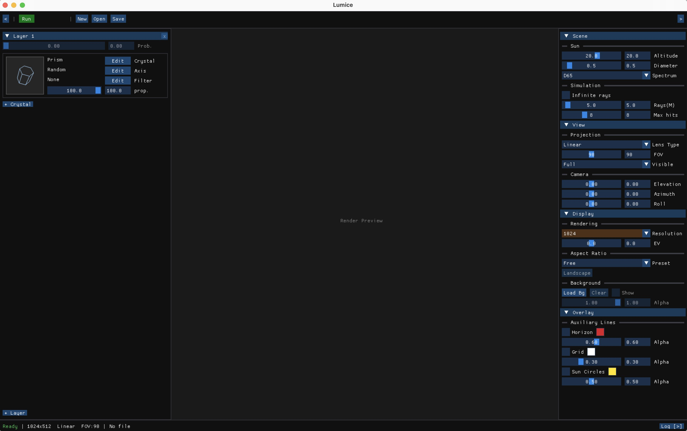
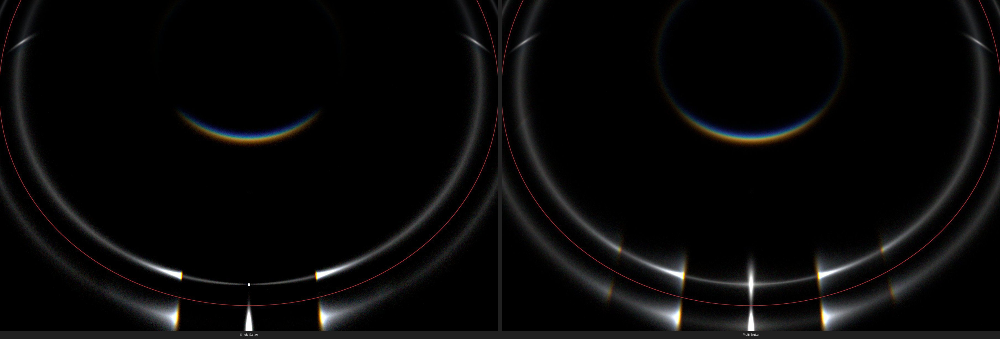
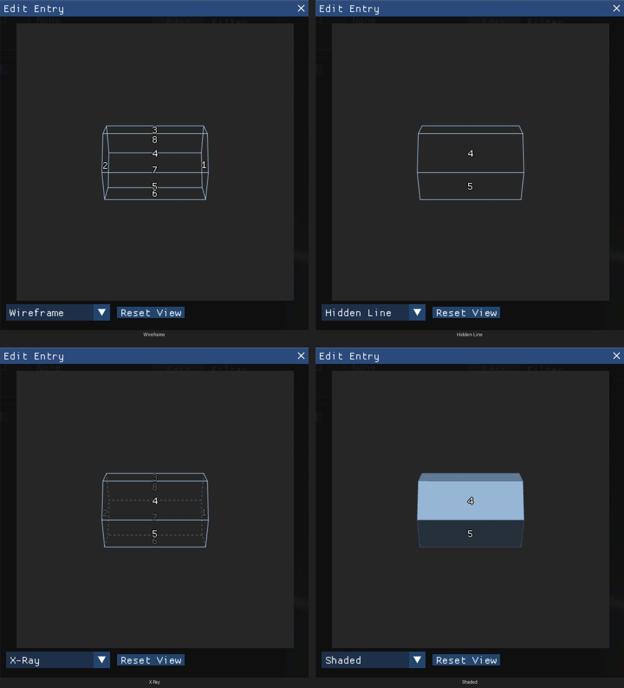
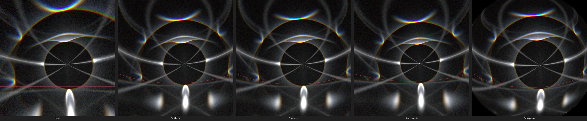
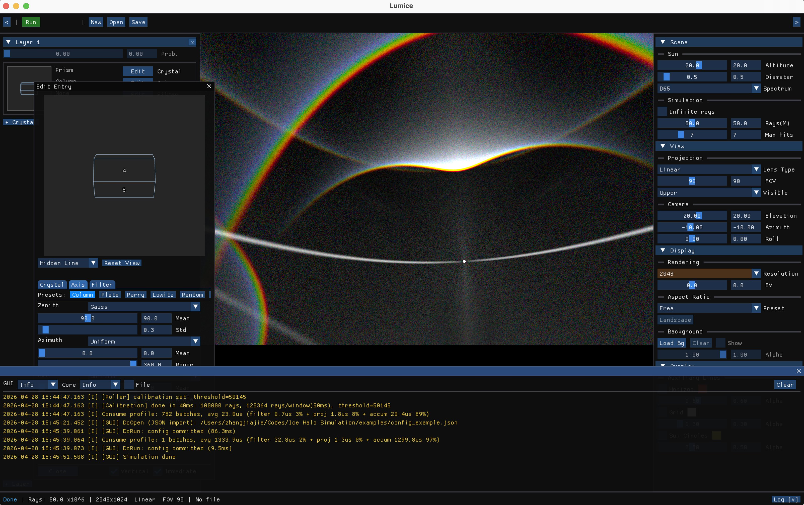
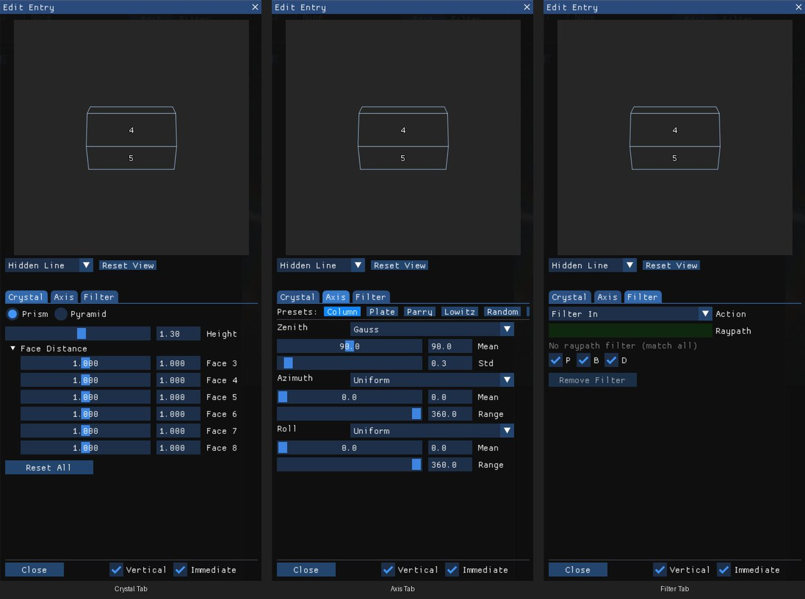

[中文版](gui-guide_zh.md)

# GUI Guide

This document describes the Lumice GUI application — an interactive graphical interface for configuring and previewing ice halo simulations.

## Building and Running

```bash
# Build the GUI application
./scripts/build.sh -gj release

# Run
./build/cmake_install/static/LumiceGUI
```

The GUI requires a display server and a GPU with OpenGL 3.2 Core Profile support.

## UI Layout

The main window is split into six regions. The same numbering is used in the labels below and in the rest of this document.



| # | Region | Purpose |
|---|--------|---------|
| 1 | Top Bar | File operations (New / Open / Save), simulation Run / Stop / Revert, panel collapse toggles |
| 2 | Left Panel — Crystal Parameters | Scattering layers and the crystal cards inside each layer (geometry / axis / filter / proportion) |
| 3 | Right Panel — View Parameters | Scene (Sun + Simulation), View (Projection + Camera), Display (Resolution / EV / Aspect / Background), Overlay |
| 4 | Render Preview | The lens-projected halo image accumulated as rays land |
| 5 | Status Bar | Simulation state badge, ray count, current resolution / lens / FOV, file name, log toggle |
| 6 | Popup Editor | Modal editor opened from a crystal card; edits Crystal / Axis / Filter in three tabs |

The left and right side panels can be collapsed independently — useful when you want a wider Render Preview during simulation.

## Top Bar

From left to right, the Top Bar exposes:

- **Left panel collapse**: `<` collapses the left panel; `>` expands it again (also bound to the `[` key).
- **Run / Stop**: a single fixed-width button that toggles between green **Run** and red **Stop** depending on the simulation state. Disabled controls during a running simulation are re-enabled once the run finishes.
- **Revert**: appears only after parameters have been changed since the last simulation finished (status `Modified`); restores the configuration that produced the last result.
- **New / Open**: project lifecycle actions (disabled while simulating).
- **Save**: opens a popup menu containing:
  - `Save` / `Save Copy` — write the project as a `.lmc` file
  - `Screenshot...` — export the current Render Preview as PNG
  - `Dual Fisheye Equal Area...` / `Equirectangular...` — server-side off-screen exports (require a finished simulation)
  - `Config JSON...` — export the configuration in JSON form
  - `Include Texture in .lmc` / `Include Overlay in Screenshot` — toggles for the next save / screenshot
- **Right panel collapse**: `<` / `>` mirror the left toggle (also bound to the `]` key).

## Left Panel — Crystal Parameters

### Layer & Crystal Cards

The left panel holds one or more **scattering layers**, each containing one or more **crystal cards**. Layers stack from top to bottom; rays exit the previous layer and enter the next with the layer's `Prob.` value (disabled when there is only one layer).



Each crystal card reflects one entry in the scattering layer:

- **Thumbnail** (left): a small 3D preview of the crystal geometry; the cache repaints when geometry or axis settings change.
- **Crystal row**: type (`Prism` / `Pyramid`) + an `Edit` button that opens the Popup Editor on the Crystal tab.
- **Axis row**: a named preset describing the axis distribution (`Parry` / `Column` / `Lowitz` / `Plate` / `Random` / `Custom`) + `Edit` opens the Axis tab.
- **Filter row**: a one-line summary of the ray-path filter + `Edit` opens the Filter tab.
- **Proportion slider** (`prop.`): how this entry is weighted within the layer (0 – 100).

The thumbnail can be drawn in four render styles. The style selector lives in the Popup Editor's persistent left preview pane (shared across the Crystal / Axis / Filter tabs) — see the [Popup Editor](#popup-editor) section.



The bottom of each layer carries a `+ Crystal` button (add another entry) and the layer header carries a right-aligned `x` (delete the layer; disabled when only one layer remains). A bottom-of-panel `+ Layer` button adds a new scattering layer.

### Card Hover Actions

Hovering a crystal card reveals two small action buttons in its top-right corner:

- `D` — duplicate the entry into the same layer (deep copy of crystal / axis / filter / proportion).
- `×` — delete the entry. Coloured red and disabled when the layer would otherwise be empty.

The buttons fade in / out via alpha so the card layout stays stable; clicks are routed even on the very first hovered frame.

### Linked Entries

Two or more crystal cards that share the same crystal configuration and filter configuration form a **linked group**. Edits made through any member — crystal shape, axis distribution, or filter — are automatically visible on every other member in the group.

**fa-link badge** — A chain link icon appears below the hover action buttons on the card's right edge whenever the card belongs to a linked group (at least one other entry shares the same crystal and filter). Hovering the badge shows a tooltip listing the other entries in the group by layer and index. The badge is always visible (not hover-revealed) because it reflects a persistent state.

**"Link to..." — entering pick mode** — Open the popup editor for any card by clicking its `Edit` button. Above the Crystal / Axis / Filter tabs you will see a sharing status line (`Not shared` or `Shared with N other entries`). Click **Link to...** to enter pick mode: the modal closes and a yellow hint bar appears at the top of the left panel:

> Pick mode: click an entry to share crystal/filter from Layer X / Entry Y (Esc to cancel)

Click any *other* card to link the current entry to it — the current entry adopts that card's crystal and filter. The popup editor reopens on the current entry so editing can continue from where it left off.

**Exiting pick mode without linking:** press `Esc`, or click any blank area in the panel (or switch panels), to cancel. The original crystal and filter are preserved.

**"Unlink"** — When the card belongs to a linked group, an **Unlink** button appears in the sharing status row of the popup editor. Clicking it forks the shared pool slots: the entry receives a private copy of its crystal and filter and leaves the group. Other members are unaffected.

**"D" (Duplicate) vs Link** — The `D` hover button (see [Card Hover Actions](#card-hover-actions)) creates a fully independent copy of the entry with its own crystal and filter. Unlike linking, the duplicate is born unlinked; subsequent edits to the original and the copy never affect each other.

**Edit propagation in a linked group:**
- Crystal and filter content edits in the popup editor are automatically reflected on all group members via the shared pool — no extra action required.
- Adding or removing a filter on one member also updates the filter reference for the entire group, so the fa-link badge remains visible and the group stays coherent.

**Co-shared highlight** — While the popup editor is open, other cards in the same linked group display an orange border. This makes it easy to see which entries will be affected by the current editing session.

## Right Panel — View Parameters

The right panel groups every parameter that influences how the simulated rays are rendered. Four collapsing sections are open by default.

### Scene

- **Sun**: `Altitude` (-90° to 90°), apparent `Diameter` (0.1° to 5°), and `Spectrum` (one of `D50` / `D55` / `D65` / `D75` / `A` / `E`).
- **Simulation**: `Infinite rays` checkbox (let the simulator keep accumulating until you stop it), `Rays(M)` count in millions when bounded, and `Max hits` per ray (1 – 20).

### View

- **Projection**: `Lens Type` chooses among 10 lens projections — Linear, Rectangular, Fisheye (Equidistant / Equal Area / Stereographic / Orthographic), and Dual Fisheye (Equidistant / Equal Area / Stereographic / Orthographic). The combo presents them grouped so orthographic variants sit next to their siblings. `FOV` is clamped per lens; `Visible` (front / back / all) restricts which hemispheres of rays render.
- **Camera**: `Elevation`, `Azimuth`, `Roll`. Disabled and forced to zero for full-sky lenses (the dual variants and the equirectangular export).

The lens choice changes the geometry of the projected image dramatically:



### Display

- **Rendering**: `Resolution` (512 / 1024 / 2048 / 4096; highlighted in brown to flag that changing it re-runs the simulation), and `EV` (-6 to +6 stops of exposure offset).
- **Adaptive Brightness**: always on — no toggle. The P99.5 brightness of the current scene (filter-independent F1 anchor) is mapped to a fixed target level; the applied offset is shown as `+N.NN EV auto` next to the manual EV slider. Filter switches do not jump the EV. See [`doc/adaptive-brightness.md`](adaptive-brightness.md) for the full algorithm and additivity invariant.
- **Aspect Ratio**: a `Preset` combo (Free, 16:9, 3:2, 4:3, 1:1, 2:1, Match Background) plus a `Portrait` ↔ `Landscape` flip button. When the requested aspect cannot be honoured (window too small) a warning row reports the achieved versus requested ratio.
- **Background**: `Load Bg...`, `Clear`, `Show` checkbox, and an `Alpha` slider for compositing the loaded background under the rendered halo.

### Overlay

The auxiliary lines drawn on top of the Render Preview, as one table — every overlay answers the same questions, so they are read as rows rather than as stacked blocks. The columns are: a colour swatch, the name, `Line` and `Label` checkboxes (toggle the projected line and the viewport-edge label independently — line-only, label-only, both, or neither), an `Alpha` cell you drag (click it to type an exact value), and a trailing `⋯` fold for the one field a row has that the others do not.

Five rows: `Horizon`, `Grid`, `Angular Dist.` (iso-angular rings centered on the sun, e.g. the 22° / 46° halos — abbreviated to fit the panel's name column), `Zenith/Nadir` (pixel-space marker dots, which carry no text label, so their `Label` cell is empty), and `Lens Border`. `Angular Dist.` opens its angle editor behind the fold — preset angles (9° / 22° / 28° / 46°) plus arbitrary custom angles — and it is offered only while the circles are actually being drawn. `Zenith/Nadir` holds its marker radius in pixels behind its own fold.

`Lens Border` outlines the lens's own image circle — the edge of the region the projection is defined on. Outside it the preview is pure black and therefore indistinguishable from the background, which is the whole reason for the line: under a fisheye the valid area is usually a circle that does not fill the display, and a halo that does not span the whole sky leaves the user no way to see where the lens ends. It is off by default, draws no text label (empty `Label` cell) and has no fold, because it owns no field of its own: the circle is derived from the lens, the FOV and the viewport.

It applies to the seven fisheye-family lenses that have such a boundary — `fisheye_equal_area`, `fisheye_equidistant`, `fisheye_orthographic` and all four `dual_fisheye_*` variants — and draws nothing for `linear`, `fisheye_stereographic`, `rectangular` or `globe`. `linear` and `rectangular` have no bounded image circle at all; `globe` does have one (the sphere's silhouette) and is left out as a product call rather than for want of a boundary. Single-lens stereographic is excluded because its image always fills the display; the dual-fisheye variants are all included because their black region comes from a hard circular clip that applies regardless of the projection formula. When the FOV puts the boundary circle off screen, nothing is drawn — that is correct behaviour, not a missing line. The border is drawn independently of the `Visible` hemisphere setting: it is the lens's frame, so it stays a whole circle even where the sky it bounds is being hidden.

## Render Preview

The central area shows the live, lens-projected halo image. While idle the area shows a disabled `Render Preview` placeholder; once a simulation starts producing rays, the texture updates each frame. Overlay labels for horizon / grid / sun circles / compass are rendered on top of the texture, projected to match the active lens.



## Popup Editor

`Edit` buttons on a crystal card open a single modal editor with three tabs (Crystal / Axis / Filter) and a persistent crystal preview pane on the left side. The preview redraws on every frame so geometry and axis edits are visible immediately. Since v15 the modal can be detached as its own OS window via ImGui multi-viewport — drag the title bar outside the host window to float it. A sharing status row above the tabs shows whether the card belongs to a linked group and provides **Link to...** and **Unlink** actions; see [Linked Entries](#linked-entries).



### Crystal Tab

Geometry of the crystal:

- **Type**: `Prism` (hexagonal prism) or `Pyramid` (hexagonal pyramid with truncated upper / lower wedges).
- **Shape parameters**: `height` for prisms; `prism_h`, `upper_h`, `lower_h`, and the wedge angles `upper_alpha` / `lower_alpha` for pyramids (the defaults map to Miller indices `{1, 0, -1, 1}`).
- **Face distance**: six values, one for each prism face, allowing irregular hexagonal cross-sections.

### Axis Tab

Three independent angular distributions controlling crystal orientation: `zenith`, `azimuth`, `roll`. Each distribution has:

- A type radio: `Gauss`, `Uniform`, `Zigzag`, `Laplacian`, or the legacy `GaussLegacy`.
- A `mean` (the centre angle) and a `std` whose meaning depends on the type — standard deviation for Gauss, full range for Uniform, amplitude for Zigzag, and scale for Laplacian.

### Filter Tab

Ray-path filtering for the crystal. The tab has two parts:

1. **Shared controls** (apply to the whole filter): an **Action** radio, plus the **`P` / `B` / `D`** symmetry checkboxes — `P` prism-face reflection, `B` basal-face reflection, `D` a further symmetry that is only offered when the crystal's axis configuration makes it applicable.
2. **A sum-of-products (SoP) row editor** where you type the predicate. A one-line summary of the resulting filter is shown on the corresponding crystal card.

#### Filter input mini-DSL

The predicate is a **sum-of-products**: an OR of rows, each row an AND of factors.

- **Each row is one OR term.** Add rows with `+ Add OR row`; a filter matches a ray if **any** row matches.
- **Within a row, `&` is AND.** `3-5 & entry:2` matches rays that satisfy both factors.
- **A blank row states nothing, so it is dropped.** It is not a wildcard: a row that matched every ray would widen the whole OR to everything (making your other rows moot), or — under **Exclude** — hide every ray and render a black frame. A filter whose rows are *all* blank is simply no filter, the same as leaving the crystal's filter unset. This holds whether the blank row was typed here or came from a `.lmc` file, so loading a config with an empty row applies the rows that say something and ignores the one that does not.

A factor is either a **raypath** or an **entry-exit** token:

| Factor | Syntax | Meaning |
|--------|--------|---------|
| Raypath | `3-5`, `1-3` | a face path |
| Raypath OR-alternatives | `1-3;3-5` | `;` = OR between raypaths; **distributes over `&`** (see below) |
| Entry face(s) | `entry:2`, `entry:1,2` | enter through face 2 (comma = face 1 **or** 2) |
| Exit face(s) | `exit:4` | exit through face 4 |
| Length (exact) | `len:3` | ray length **is exactly** 3 |
| Length (at most) | `len:<=5` | ray length **≤** 5 |
| Length (range) | `len:2-3` | ray length in **[2, 3]** |

**`,` is not a raypath connector.** Only `-` joins faces on the same path, and `;` separates alternate paths; a raypath token containing `,` (e.g. `3-5,1-2`) is rejected, with a message naming both. It used to be accepted as a second spelling of `-`, which meant `3-5,1-2` — typed to mean *two* paths — silently became the single four-face path `3-5-1-2` and rendered almost nothing. The `entry:1,2` comma in the table above is different, deliberate syntax: an OR-list on one entry/exit token, not a raypath. A `.lmc` written before this was enforced still loads — the `,` in its raypath tokens is rewritten to `-` on load, keeping the path it had, and the file is normalized the next time you save.

`entry:` / `exit:` / `len:` tokens in the **same row** merge into a single entry-exit factor (so `entry:2 & exit:4 & len:<=5` is one entry-exit predicate, not three). Repeating a token in one row is an error — use the comma list for multiple faces (`entry:2,3`, not `entry:2 & entry:3`).

**Examples**

| Intent | Type |
|--------|------|
| enter face 2 **and** exit face 4 **and** length ≤ 5 | `entry:2 & exit:4 & len:<=5` |
| raypath `1-3` **or** raypath `3-5` | `1-3;3-5` (one row) or two rows `1-3` / `3-5` |
| (`1-3` or `3-5`) **and** enter face 2 | `1-3;3-5 & entry:2` → `(1-3 & entry:2) OR (3-5 & entry:2)` |

`;` (and the `entry:1,2` comma list) is display sugar only — it fans out to separate OR terms when the filter is applied, so the underlying model stays a plain sum-of-products. A **live preview** below the rows shows the expanded predicate as you type, and the **ⓘ icon** next to the hint lists the full token syntax.

**A hand-written config can still ask for a wildcard.** The dropped-blank-row rule above is about a row that carries no predicate at all. A core config file (the CLI format, or one this GUI exported) can ask for a filter that admits every ray by writing `{"type": "none"}`, or by leaving the `type` key off the filter entirely; both are kept as a match-all row and can sit beside real alternatives in a composition. The two are different things arriving by different routes: an empty editor row is an unfinished thought, a `none` filter is a request.

**One shape is refused instead: `{"type": "raypath", "raypath": []}`.** An empty face list is not a wildcard — the simulator compares each ray's recorded path against the listed one, an empty list has nothing any ray can equal, and the filter therefore matches **no ray at all**. Under **Include** that renders a black frame. The editor has no row that says "no ray", and its nearest row (an empty one) says the opposite, so a filter of this shape is dropped on import with a warning naming it, rather than shown as something it is not. Any entry that referenced it opens with no filter; re-save the document and the filter is gone from it. Write the ray paths you want, or `{"type": "none"}` if you meant every ray.

For the filter architecture behind this editor (physical gate semantics, the `ComplexFilterParam` sum-of-products, the 1:1 crystal binding), see [`filter-architecture.md`](filter-architecture.md).

## Status Bar

From left to right:

- **Simulation state**: `Ready` (green), `Simulating...` (yellow), `Done` (blue), `Modified` (orange).
- **Rays accumulated** (when non-zero): scaled to `x10^3 / x10^6 / x10^9`.
- **Resolution / lens / FOV**: e.g. `1024x512 Fisheye Equal Area FOV:180`.
- **File name** with `*` indicator when the project has unsaved changes.
- **Log toggle** (right-aligned): `Log [>]` opens / closes the log panel along the bottom of the window.

## File Operations

### Keyboard Shortcuts

| Shortcut | Action |
|----------|--------|
| Ctrl+S | Save project |
| Ctrl+Shift+S | Save Copy (as a new file) |
| `[` | Toggle left panel collapse |
| `]` | Toggle right panel collapse |

Run, Stop, New, and Open are not bound to keys — use the Top Bar buttons. Export operations (Screenshot, Dual Fisheye Equal Area, Equirectangular, Config JSON) are reachable through the Save menu popup.

### Project File Format (`.lmc`)

Lumice uses a binary project file format (`.lmc`) that stores:

- **Configuration**: all crystal, scene, render, and filter settings as semantic JSON
- **Preview texture**: optional embedded PNG of the most recent render result

The format uses a 44-byte header with magic number `LMC\0`, version field, and offset / size pointers to the JSON and texture payloads. Values are stored as human-readable semantic types (e.g. `"prism"` instead of enum indices) for forward compatibility.

### Unsaved Changes

When the project has unsaved changes (`*` indicator in the status bar), the application warns before:

- creating a new project
- opening another project
- closing the application

The warning popup offers `Save`, `Don't Save`, and `Cancel`.

## Simulation Workflow

1. **Configure**: set up scattering layers and crystal cards in the left panel, then scene / view / display / overlay in the right panel.
2. **Run**: click `Run` in the Top Bar. The current configuration is serialised and submitted to the simulation core; parameter widgets are disabled during the run.
3. **Monitor**: the Status Bar reports the running state and accumulated ray count; the Render Preview updates continuously.
4. **View**: results stay in the Render Preview after the run finishes (state `Done`).
5. **Stop**: click `Stop` to halt early. Results accumulated up to that point remain visible.
6. **Revert**: if you have changed parameters after the run finished (state `Modified`), `Revert` restores the configuration that produced the last result.

The simulation state — `Ready`, `Simulating`, `Done`, `Modified` — is shown in the status bar and gates which Top Bar actions are enabled.

## Related Documentation

- [Configuration Guide](configuration.md) — detailed configuration reference (JSON format)
- [Architecture Document](architecture.md) — system architecture and GUI module design
- [Developer Guide](developer-guide.md) — GUI testing and development
- [User Manual — GUI Quickstart](user-manual/02-gui-quickstart.md) — step-by-step tour for first-time users
