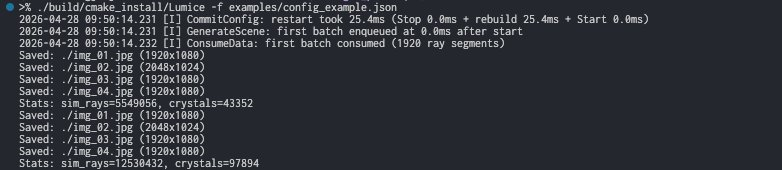
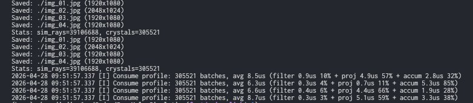

[中文版](01-install_zh.md)

# Install and Build Lumice

This chapter walks you from a fresh clone to a working `Lumice` binary (and, if you want it, `LumiceGUI`), plus a smoke test that confirms the toolchain is wired up correctly.

## Prerequisites

Lumice is a C++17 project built with CMake. You need the following on `PATH`:

| Tool | Minimum | Notes |
|------|---------|-------|
| C++ compiler | C++17 | Apple Clang ≥ 14, GCC ≥ 11, MSVC 2022 |
| CMake | 3.14 | `cmake --version` |
| Ninja | 1.10 | recommended generator (`ninja --version`); `scripts/build.sh` passes `-G Ninja` |
| Python | 3.9 | required by **every** build: CMake runs `scripts/embed_binary.py` at build time to embed the label font. Also runs the E2E tests under `test/` |
| OpenGL dev packages | — | GUI build (`-g`) only. macOS and Windows need nothing extra. On Linux GLFW builds against X11 and the file dialog against GTK 3: `sudo apt-get install libgl-dev libx11-dev libxrandr-dev libxinerama-dev libxcursor-dev libxi-dev libgtk-3-dev` |

External libraries (spdlog, nlohmann/json, stb, googletest, and for the GUI GLFW, Dear ImGui, nativefiledialog-extended, …) are fetched automatically via [CPM.cmake](https://github.com/cpm-cmake/CPM.cmake) at configure time — you do not need to install them by hand. The downloaded sources are cached per machine under `$HOME/.cache/lumice-cpm` (`$USERPROFILE/.cache/lumice-cpm` on a Windows shell that sets no `HOME`), so a second clone or worktree on the same machine does not re-download them; set `CPM_SOURCE_CACHE` to move the cache elsewhere.

## Build

The convenience script `scripts/build.sh` is the supported way to build:

```bash
# Release build of the CLI, parallel, install artefacts under build/cmake_install/static/
./scripts/build.sh -j release
```

Other useful flavours (see `scripts/build.sh -h` for the full list):

```bash
./scripts/build.sh -gj release    # build the GUI as well (Dear ImGui + GLFW + OpenGL)
./scripts/build.sh -tj release    # build + run unit tests
./scripts/build.sh -gtj release   # build GUI + run unit tests and GUI tests (needs a display server)
LUMICE_SKIP_GUI_TESTS=1 ./scripts/build.sh -gtj release   # skip GUI tests on a headless box
./scripts/build.sh -k release     # clean this flavour's build tree and rebuild (keeps the CPM cache)
```

`-t` / `-g` / `-b` choose *what* to build (tests / GUI app / benchmarks); the GUI binary only exists after a build that passed `-g`. `-s` switches the library flavour to shared (static when omitted) and composes with any of them.

After a successful release build, the artefacts you care about live here:

| Artefact | Path | Purpose |
|----------|------|---------|
| CLI binary | `build/cmake_install/static/Lumice` | Run a JSON config from the command line |
| GUI binary | `build/cmake_install/static/LumiceGUI` | Interactive GUI app (only built with `-g`; no runtime dependency beyond the system's OpenGL driver) |

> Both trees are per-flavor: a `-s` (shared) build never shares a directory with a static one. The
> CMake build tree is `build/cmake_build/<flavor>/`. Release artefacts in `build/cmake_install/static/`
> are what the rest of this manual assumes.



## Smoke test

Run the bundled example config to confirm the binary works end-to-end. From the project root (the CLI does not create the output directory for you):

```bash
mkdir -p /tmp/lumice-smoke
./build/cmake_install/static/Lumice -f examples/config_example.json -o /tmp/lumice-smoke
```

You should see:

1. A few `[I]` log lines at startup (`CommitConfig`, `GenerateScene`, `ConsumeData`) identifying the run.
2. Roughly once per second, a `Saved: ...` line per output image followed by a `Stats: sim_rays=..., crystals=..., orientations=...` line — the CLI re-saves its intermediate renders as the simulation accumulates.
3. A final `Saved:` / `Stats:` block once all rays are traced.
4. Four `.jpg` files in `/tmp/lumice-smoke/`, named `img_01.jpg` … `img_04.jpg` (one per `render` entry in the config).



If you see all four images, the toolchain is healthy.

> The example config sets `scene.ray_num` to `4.5e8` — the total across its 9 spectral wavelengths. On a recent multi-core laptop this takes about 2 minutes. To get a faster smoke test, copy the example and lower `scene.ray_num` to `1e6`.

## Common build issues

| Symptom | Likely cause | Fix |
|---------|--------------|-----|
| `cmake: command not found` | CMake not installed or not on `PATH` | Install via Homebrew / apt / official installer |
| Build fails downloading dependencies | First build with no CPM cache and no network | Re-run with network access; CPM caches under `$HOME/.cache/lumice-cpm` (or wherever `CPM_SOURCE_CACHE` points) |
| Configure fails on `Python3` | No Python 3 interpreter on `PATH` | Install Python 3 — every build needs it to embed fonts |
| GUI configure fails in GLFW / nfd (Linux) | X11 / OpenGL / GTK 3 dev headers missing | Install the packages from the prerequisites table, or build without the GUI (drop `-g`) |
| GUI exits at startup with a GLFW / OpenGL error | No display, or no OpenGL 3.3 driver on the loader path | Run on a machine with a desktop session; on a headless box use the CLI instead |
| `LUMICE_SKIP_GUI_TESTS` ignored on CI | Stale cached config | `./scripts/build.sh -k release` to clean rebuild |

## Further reading

- Run your first config in the GUI → [`02-gui-quickstart.md`](02-gui-quickstart.md)
- Or run it from the CLI → [`03-cli-quickstart.md`](03-cli-quickstart.md)
- Build flag reference → [`../developer-guide.md`](../developer-guide.md)
