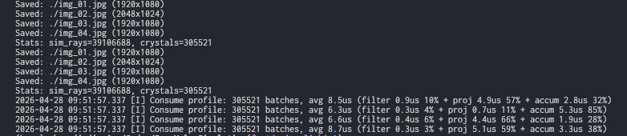

[English version](01-install.md)

# 安装与构建 Lumice

本章带你从一份干净的 clone，走到一对可用的 `Lumice` / `LumiceGUI` 二进制文件，并执行一次 smoke test 确认工具链就位。

## 前置依赖

Lumice 是一个使用 CMake 构建的 C++17 项目，环境需要：

| 工具 | 最低版本 | 说明 |
|------|----------|------|
| C++ 编译器 | C++17 | Apple Clang ≥ 14、GCC ≥ 11、MSVC 2022 |
| CMake | 3.20 | `cmake --version` 验证 |
| Ninja | 1.10 | 推荐使用的 generator（`ninja --version`）|
| Python | 3.9 | 仅在跑 `test/e2e/` 时需要 |
| Qt 6 | 6.5 | 可选，仅 GUI 需要 |

外部依赖（spdlog、nlohmann/json、stb、googletest 等）在 configure 阶段由 [CPM.cmake](https://github.com/cpm-cmake/CPM.cmake) 自动拉取，无需手动安装。

## 构建

推荐用脚本 `scripts/build.sh` 构建：

```bash
# Release 构建，并行，产物安装到 build/cmake_install/
./scripts/build.sh -j release
```

其他常用变体（完整列表见 `scripts/build.sh -h`）：

```bash
./scripts/build.sh -tj release    # 构建 + 跑单元测试
./scripts/build.sh -gtj release   # 构建 + 跑 GUI 测试（需要显示服务器）
LUMICE_SKIP_GUI_TESTS=1 ./scripts/build.sh -gtj release   # 在无显示器的机器上跳过 GUI 测试
./scripts/build.sh -k release     # 清理后重新构建
```

Release 构建成功后，关键产物位置如下：

| 产物 | 路径 | 用途 |
|------|------|------|
| CLI 二进制 | `build/cmake_install/Lumice` | 命令行执行 JSON 配置 |
| GUI 二进制 | `build/cmake_install/LumiceGUI` | 交互式 GUI（依赖 Qt）|

> Debug 构建产物位于 `build/cmake_build/`。本手册其余章节默认使用 `build/cmake_install/` 下的 Release 产物。


## Smoke test

跑一遍内置示例配置，确认端到端可用。在项目根目录执行：

```bash
./build/cmake_install/Lumice -f examples/config_example.json -o /tmp/lumice-smoke
```

你应该看到：

1. 一段简短的版本横幅；
2. 模拟过程中按 batch 输出的进度信息；
3. 结尾的 `Stats: ...` 块（汇总光线总数等）；
4. `/tmp/lumice-smoke/` 下生成 4 个 `.jpg` 文件，文件名形如 `example_img_01.jpg` … `example_img_04.jpg`。



只要 4 张图都生成出来，就说明工具链没问题。

> 示例配置使用了 9 段离散波长 × `ray_num=5e7`，模拟器实际追踪 ~4.5 × 10⁸ 条光线。在较新的多核笔记本上需要几分钟。想跑得更快？把示例 copy 一份，把 `scene.ray_num` 改到 `1e6` 即可。

## 常见构建问题

| 现象 | 可能原因 | 处理 |
|------|----------|------|
| `cmake: command not found` | 未安装 CMake 或不在 `PATH` | Homebrew / apt / 官方安装包安装 |
| 拉依赖失败 | 首次构建无 CPM 缓存且无网络 | 切到有网环境重试，CPM 缓存默认在 `~/.cache/CPM` |
| GUI 启动报 Qt 错误 | Qt 6 不在 loader 路径 | 系统级安装 Qt 6，或加 `-DLUMICE_BUILD_GUI=OFF` 跳过 GUI |
| `LUMICE_SKIP_GUI_TESTS` 在 CI 上不生效 | 配置缓存陈旧 | `./scripts/build.sh -k release` 清理重建 |

## 延伸阅读

- 在 GUI 里跑第一个配置 → [`02-gui-quickstart_zh.md`](02-gui-quickstart_zh.md)
- 或者在 CLI 里跑 → [`03-cli-quickstart_zh.md`](03-cli-quickstart_zh.md)
- 构建 flag 参考 → [`../developer-guide_zh.md`](../developer-guide_zh.md)
