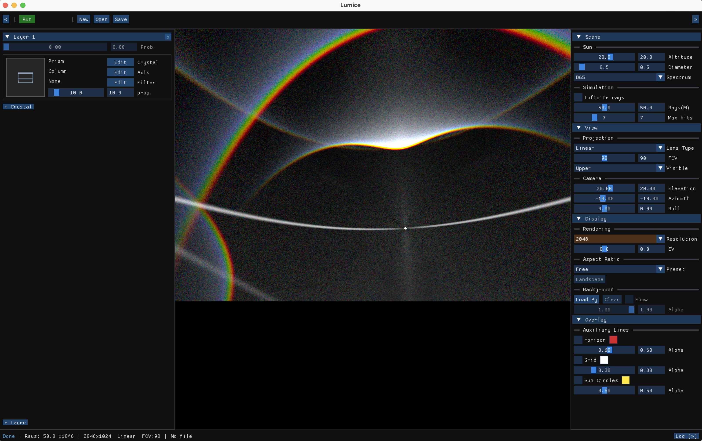
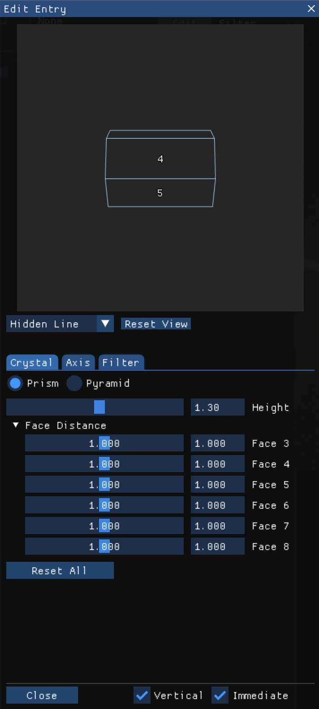

[中文版](02-gui-quickstart_zh.md)

# GUI Quickstart

This chapter walks you through your first interactive simulation in the Lumice GUI: launch the app, load the bundled example, run, and read the preview. By the end you will know which panels to click and what the floating overlays mean.

> **Prerequisite**: a release build with the GUI enabled (`./scripts/build.sh -j release` produces `build/cmake_install/LumiceGUI`).

## 1. Launch

```bash
./build/cmake_install/LumiceGUI
```

On first launch the main window opens with no project loaded:


## 2. Tour of the main window

The annotated screenshot below labels the six regions you will use most often. The same numbering is used throughout this manual.


| # | Region | Purpose |
|---|--------|---------|
| 1 | Top Bar | Open / save project, simulation Run/Stop, status badges |
| 2 | Left Panel | Crystal list, Light Source, Scattering, Render configuration cards |
| 3 | Crystal Preview | 3D preview of the currently selected crystal (wireframe / hidden line / x-ray / shaded) |
| 4 | Render Preview | Live halo image accumulated as rays land |
| 5 | Floating Lens Bar | Quick switch between lens projections (linear, equidistant fisheye, equal-area, …) |
| 6 | Status Bar | Current ray count, elapsed time, log severity counts |

> Region names are chosen for **what they do**, not what they look like — UI colours and pixel positions may drift between releases, but these six functions are stable.

## 3. Load the bundled example

`File ▶ Open` and choose `examples/config_example.json`. The Left Panel populates with the example's four crystals, light source, scattering layers, and one render entry:



The Crystal Preview shows the selected crystal in 3D. Click any crystal in the list to swap the preview.

## 4. Run a simulation and read the preview

Press the **Run** button in the Top Bar. The Render Preview accumulates rays in real time:


While running:

- The Status Bar shows ray count and elapsed time.
- The Floating Lens Bar lets you switch lens projection without stopping the simulation — the same data is re-projected on the fly.
- The grid overlay (visible above) is **GUI-only** and is not saved into the JSON config — it only helps you read angles in the preview.

To stop early, press **Stop** in the Top Bar; partial results stay on screen.

## 5. Author a new entry from scratch

Want to build a halo recipe yourself instead of opening the example? The shortest path is:

1. **File ▶ New** to start an empty project.
2. In the Left Panel **Crystal** card, click **Edit** (or **+ Add**) to open the Crystal Editor:

   

   Pick a preset (e.g. **Hexagonal Prism**), tweak `height` and `face_distance` if you wish, and confirm.
3. Open **Light Source** in the Left Panel and set `azimuth` (sun direction) and `altitude` (sun height above horizon).
4. Open **Render** and pick a lens, resolution, and field of view — the Floating Lens Bar can re-project later, so any sane default is fine.
5. Press **Run**.

> 📷 待补：Crystal Tab 整体截图（registered in `progress.md` placeholder list; will be folded into SUMMARY.md "待补充清单" at closeout).

## 6. Save and reload

`File ▶ Save As` writes a `.lmc` (a JSON document Lumice can also run from the CLI). Reopening it in the GUI restores **crystal / light / render** data — but **not** the GUI-only state (lens projection choice, grid overlay, crystal preview style). See [`05-faq.md`](05-faq.md) "GUI vs JSON capabilities" for the full divergence list.

## Further reading

- Run the same `.lmc` headless from the CLI → [`03-cli-quickstart.md`](03-cli-quickstart.md)
- Reproduce classic halos with ready-made recipes → [`04-recipes.md`](04-recipes.md)
- Full panel reference → [`../gui-guide.md`](../gui-guide.md)
- All field names and types → [`../configuration.md`](../configuration.md)
