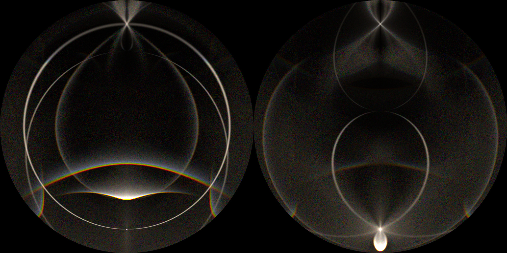
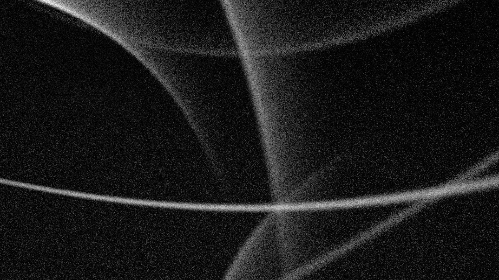
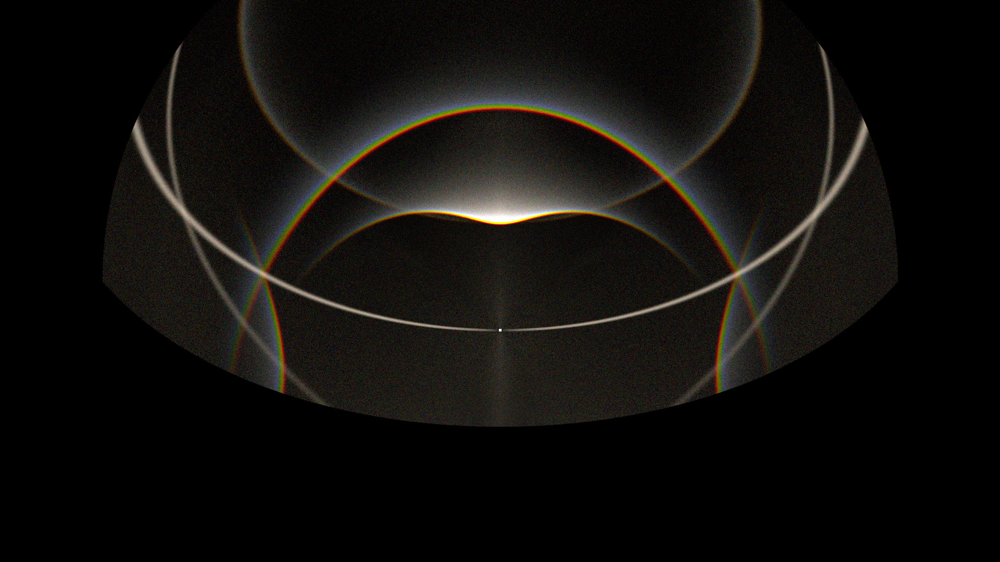

[中文版](03-cli-quickstart_zh.md)

# CLI Quickstart

This chapter shows how to run Lumice from the command line — useful for batch jobs, CI, headless servers, and reproducible recipes.

> **Prerequisite**: `build/cmake_install/Lumice` exists. If not, see [`01-install.md`](01-install.md).

## 1. Basic invocation

The minimal call is:

```bash
./build/cmake_install/Lumice -f examples/config_example.json
```

This writes JPEG output(s) to the current working directory. To pick an output directory:

```bash
./build/cmake_install/Lumice -f examples/config_example.json -o /tmp/lumice-out
```


## 2. Reading the output

After the run, the output directory contains one image per render entry in your config. The bundled example defines four render entries, so you get four files:

| File | Lens / view | Notes |
|------|-------------|-------|
| `example_img_01.jpg` | Equal-area dual fisheye, full sky | The default "everything in the sky" view |
| `example_img_02.jpg` | Linear lens, narrower FOV | Closer to a camera-with-fisheye-removed view |
| `example_img_03.jpg` | Equidistant fisheye | Useful for angle measurement |
| `example_img_04.jpg` | Stereographic fisheye | Preserves circle shapes near the horizon |






The console also prints a `Stats:` block summarising the simulation (ray counts, elapsed time, per-wavelength accumulation). Capture this if you want a reproducibility receipt.

## 3. Verbose and debug modes

```bash
./build/cmake_install/Lumice -f config.json -v   # trace-level logs
./build/cmake_install/Lumice -f config.json -d   # debug-level logs
```

`-v` is roughly "show me the per-batch ray counts as they are produced"; `-d` adds extra diagnostics (RNG seeds, scattering layer dispatch). Use `-v` first; reach for `-d` only when chasing a bug.

## 4. All flags at a glance

The complete set of flags as printed by `Lumice -h` (anchor source: `./build/cmake_install/Lumice -h`):

```text
Usage: ./build/cmake_install/Lumice -f <config_file> [options]

Options:
  -f <file>          Specify the configuration file (required)
  -o <dir>           Output directory for rendered images (default: current directory)
  --format <fmt>     Output image format: jpg or png (default: jpg)
  --quality <1-100>  JPEG quality (default: 95, ignored for PNG)
  --benchmark        Run dual-mode benchmark (single-worker + multi-worker)
                     and emit two [BENCHMARK] JSON lines
  -v                 Verbose output (trace level logging)
  -d                 Debug output (debug level logging)
  -h                 Show this help message and exit
```

Notes:

- `-f` is the only required flag. Without it, Lumice exits non-zero with a usage hint.
- `--format png` switches to lossless PNG; `--quality` is ignored in that case.
- `--benchmark` is for performance regression testing — see [`../performance-testing.md`](../performance-testing.md). It is **not** how you run a normal simulation.

## 5. Performance expectations

Lumice traces light wavelength-by-wavelength. For a discrete spectrum (the typical case in `light_source.spectrum: [{wavelength, weight}, ...]`), the work scales as **`ray_num × N(wavelengths)`**. The example config uses 9 wavelengths × `ray_num=5e7` ⇒ ~4.5 × 10⁸ rays.

Practical first-run advice:

- Want a result in seconds? Drop `ray_num` to `1e6` and use a single wavelength (e.g. `[{"wavelength": 550, "weight": 1.0}]`).
- Want a publication-quality image? Keep `ray_num=5e7` or higher and the full 9-wavelength spectrum, and expect a few minutes on a modern multi-core laptop.

For the precise relationship between `ray_num`, batches, and wavelengths, and for performance tuning beyond the basics, see [`05-faq.md`](05-faq.md) "ray_num × wavelength semantics" and [`../performance-testing.md`](../performance-testing.md).

## Further reading

- Try ready-made recipes → [`04-recipes.md`](04-recipes.md)
- FAQ, defaults, GUI vs JSON differences → [`05-faq.md`](05-faq.md)
- Full schema → [`../configuration.md`](../configuration.md)
