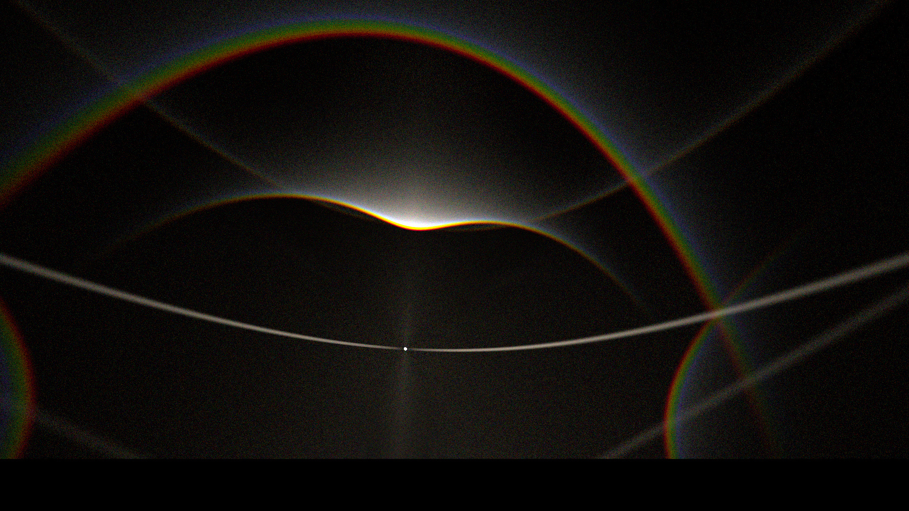
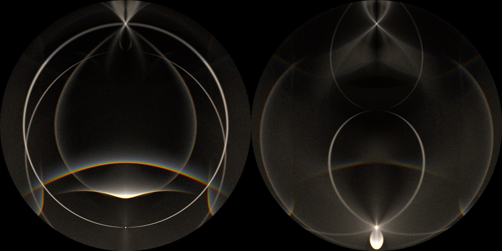
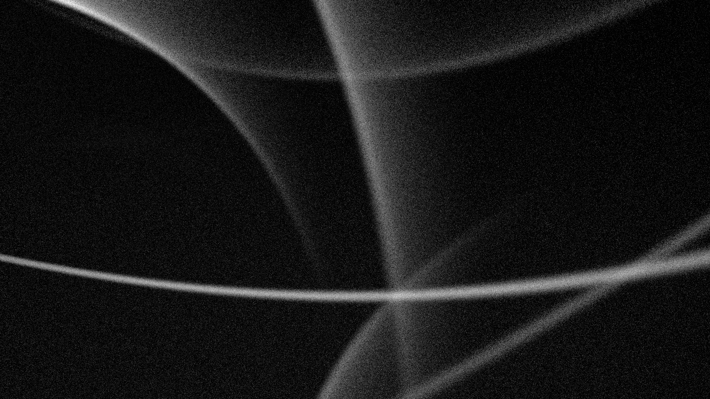
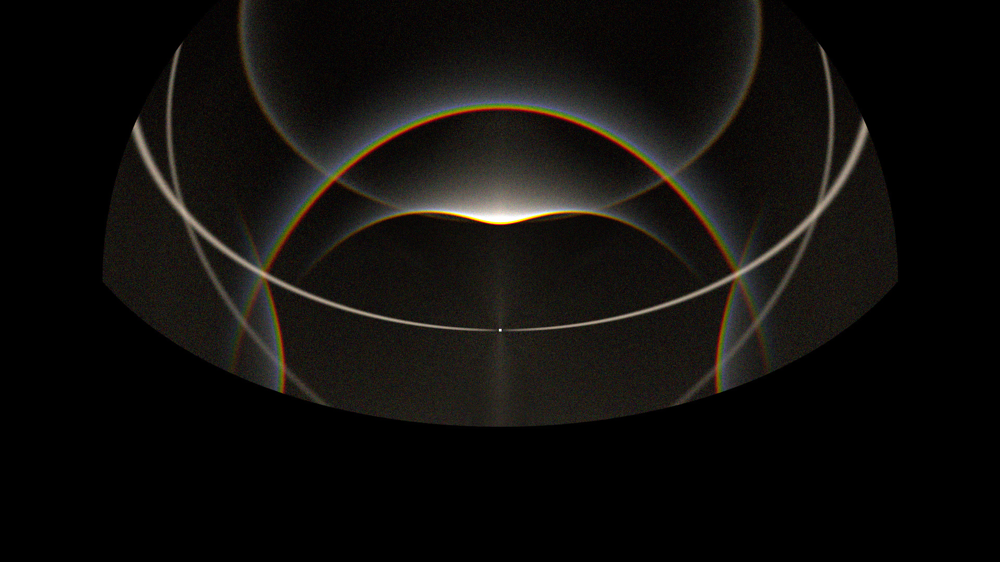

[中文版](03-cli-quickstart_zh.md)

# CLI Quickstart

This chapter shows how to run Lumice from the command line — useful for batch jobs, CI, headless servers, and reproducible recipes.

> **Prerequisite**: `build/cmake_install/static/Lumice` exists. If not, see [`01-install.md`](01-install.md).

## 1. Basic invocation

The minimal call is:

```bash
./build/cmake_install/static/Lumice -f examples/config_example.json
```

This writes JPEG output(s) to the current working directory. To pick an output directory:

```bash
./build/cmake_install/static/Lumice -f examples/config_example.json -o /tmp/lumice-out
```


## 2. Reading the output

After the run, the output directory contains one image per render entry in your config. The bundled example defines four render entries, so you get four files:

| File | Lens / view | Notes |
|------|-------------|-------|
| `example_img_01.jpg` | Equal-area dual fisheye, full sky | The default "everything in the sky" view |
| `example_img_02.jpg` | Linear lens, narrower FOV | Closer to a camera-with-fisheye-removed view |
| `example_img_03.jpg` | Equidistant fisheye | Useful for angle measurement |
| `example_img_04.jpg` | Stereographic fisheye | Preserves circle shapes near the horizon |






The console also prints a `Stats:` block summarising the simulation (ray counts, elapsed time, per-wavelength accumulation). Capture this if you want a reproducibility receipt.

## 3. Verbose and debug modes

```bash
./build/cmake_install/static/Lumice -f config.json -v   # trace-level logs
./build/cmake_install/static/Lumice -f config.json -d   # debug-level logs
```

`-v` is roughly "show me the per-batch ray counts as they are produced"; `-d` adds extra diagnostics (RNG seeds, scattering layer dispatch). Use `-v` first; reach for `-d` only when chasing a bug.

## 4. All flags at a glance

The CLI has two subcommands, `render` and `benchmark`. `render` is the default: `Lumice -f config.json` and `Lumice render -f config.json` are the same command, so every example above is a render. Each subcommand accepts only its own options; `Lumice <subcommand> -h` prints that subcommand's page.

The complete set as printed by `Lumice -h` (anchor source: `./build/cmake_install/static/Lumice -h`):

```text
Usage: ./build/cmake_install/static/Lumice [render] -f <config_file> [options]
       ./build/cmake_install/static/Lumice benchmark -f <config_file> [options]
       ./build/cmake_install/static/Lumice <subcommand> -h

Lumice — simulate ice halos by tracing rays through ice crystals.

Subcommands:
  render             Simulate and write halo images. This is the default when
                     no subcommand is given: `./build/cmake_install/static/Lumice -f ...` is a render.
  benchmark          Run a throughput benchmark and print [BENCHMARK] JSON
                     (`./build/cmake_install/static/Lumice benchmark -h` for its options)

Options for render (the default subcommand):
  -f <file>          Specify the configuration file (required)
  --backend <name>   Trace backend: auto, cpu, metal, or cuda (default: auto).
                     'auto' and 'cpu' both select the CPU route today; 'metal'
                     falls back to CPU if unavailable. The LUMICE_TRACE_BACKEND
                     env var, if set, still overrides this (debug/CI only).
  -v                 Verbose output (trace level logging)
  -d                 Debug output (debug level logging)
  -h, --help         Show this help message and exit
  -o <dir>           Output directory for rendered images (default: current directory)
  --format <fmt>     Output image format: jpg or png (default: jpg)
  --quality <1-100>  JPEG quality (default: 95, ignored for PNG)
  --workers <N>      Number of CPU simulation worker threads (default: automatic —
                     one per physical core, capped at a ceiling above which no
                     machine measured ran faster; an explicit N is never capped).
                     Machine-dependent, so it is a command-line switch rather than
                     a config-file field: a config travels between machines and a
                     worker count should not travel with it. Ignored on a GPU route
                     (single engine).

Examples:
  ./build/cmake_install/static/Lumice -f config.json
  ./build/cmake_install/static/Lumice -f config.json -o /tmp/output
  ./build/cmake_install/static/Lumice -f config.json --format png
  ./build/cmake_install/static/Lumice -f config.json --quality 80
  ./build/cmake_install/static/Lumice -f config.json --backend metal
  ./build/cmake_install/static/Lumice -f config.json --workers 4
  ./build/cmake_install/static/Lumice -f config.json -v
  ./build/cmake_install/static/Lumice benchmark -f examples/bench_config.json
```

`Lumice benchmark -h`:

```text
Usage: ./build/cmake_install/static/Lumice benchmark -f <config_file> [options]

Run a throughput benchmark and print [BENCHMARK] JSON. The legacy CPU route
runs a dual pass (single-worker + multi-worker → per-core and parallel-
efficiency data); a GPU route is single-engine, so it runs one steady pass
only (single/multi would not be parallel). The worker counts are part of the
measurement methodology, which is why there is no --workers here; nothing is
written to disk, which is why there is no -o.

Options:
  -f <file>          Specify the configuration file (required)
  --backend <name>   Trace backend: auto, cpu, metal, or cuda (default: auto).
                     'auto' and 'cpu' both select the CPU route today; 'metal'
                     falls back to CPU if unavailable. The LUMICE_TRACE_BACKEND
                     env var, if set, still overrides this (debug/CI only).
  -v                 Verbose output (trace level logging)
  -d                 Debug output (debug level logging)
  -h, --help         Show this help message and exit

Examples:
  ./build/cmake_install/static/Lumice benchmark -f examples/bench_config.json
  ./build/cmake_install/static/Lumice benchmark -f examples/bench_config.json --backend metal
```

Notes:

- `-f` is the only required flag. Without it, Lumice exits non-zero with a usage hint.
- `--format png` switches to lossless PNG; `--quality` is ignored in that case.
- `--workers <N>` overrides the automatic worker count (one per physical core, capped at a measured ceiling; the cap applies to the automatic value only, never to an `N` you name). It is a switch rather than a config field on purpose: a worker count describes the machine, and a config file travels between machines. An illegal value (`0`, negative, non-numeric) exits non-zero rather than falling back to the default.
- `Lumice benchmark -f <config>` is for performance regression testing — see [`../performance-testing.md`](../performance-testing.md). It is **not** how you run a normal simulation, and it takes only `-f`, `--backend`, `-v`, `-d`, `-h` (no `-o`: it writes nothing; no `--workers`: the worker counts are the measurement itself). The former `--benchmark` flag exits with a hint pointing here.

## 5. Performance expectations

Lumice traces light wavelength-by-wavelength. For a discrete spectrum (the typical case in `light_source.spectrum: [{wavelength, weight}, ...]`), the work scales as **`ray_num × N(wavelengths)`**. The example config uses 9 wavelengths × `ray_num=5e7` ⇒ ~4.5 × 10⁸ rays.

Practical first-run advice:

- Want a result in seconds? Drop `ray_num` to `1e6` and use a single wavelength (e.g. `[{"wavelength": 550, "weight": 1.0}]`).
- Want a publication-quality image? Keep `ray_num=5e7` or higher and the full 9-wavelength spectrum, and expect about 2 minutes on a modern multi-core laptop.

For the precise relationship between `ray_num`, batches, and wavelengths, and for performance tuning beyond the basics, see [`05-faq.md`](05-faq.md) "ray_num × wavelength semantics" and [`../performance-testing.md`](../performance-testing.md).

## Further reading

- Try ready-made recipes → [`04-recipes.md`](04-recipes.md)
- FAQ, defaults, GUI vs JSON differences → [`05-faq.md`](05-faq.md)
- Full schema → [`../configuration.md`](../configuration.md)
