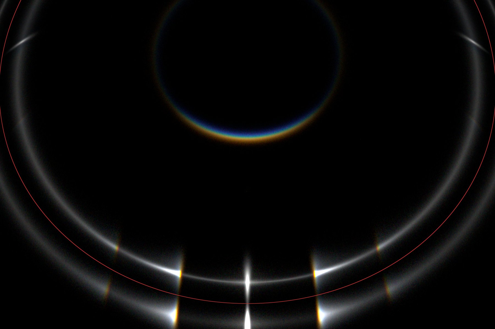

[English version](04-recipes.md)

# 配方 — 复现经典光晕

本章给出 3 个可直接运行的配方，复现广为人知的光晕现象。每个配方包含：

- 现象简述与输出特征；
- 最小 JSON 配置（直接给 `Lumice -f <file>` 用）；
- 预期耗时与视觉效果；
- 想调整参数时该去 schema 哪里查。

> 配方按"最小可跑"设计：`ray_num` 偏小，方便快速看到效果。要拿到干净低噪点的图，把 `ray_num` 升到 `5e7` 或更高即可。

## 配方 1 — 22° 光晕（最经典）

最常见的光晕：太阳周围 22° 的明亮圆环，由光线穿过随机取向的六棱柱晶体的 60° 棱面折射而成。

**预期输出**：以太阳为中心的连续圆环，内边缘最亮，向外渐暗。下方为 50M 光线下的参考渲染：


**配置**（`recipes/22-halo.json`，inline）：

```json
{
  "crystal": [
    {
      "id": 1,
      "type": "prism",
      "shape": { "height": 1.2 }
    }
  ],
  "filter": [
    { "id": 1, "type": "none", "symmetry": "P" }
  ],
  "scene": {
    "light_source": {
      "type": "sun",
      "altitude": 20.0,
      "spectrum": [
        {"wavelength": 420, "weight": 1.0},
        {"wavelength": 550, "weight": 1.0},
        {"wavelength": 660, "weight": 1.0}
      ]
    },
    "ray_num": 1000000,
    "max_hits": 7,
    "scattering": [
      { "prob": 1.0, "entries": [{ "crystal": 1, "proportion": 1.0, "filter": 1 }] }
    ]
  },
  "render": [
    {
      "id": 1,
      "lens": { "type": "fisheye_equidistant", "fov": 60 },
      "resolution": [800, 800],
      "view": { "elevation": 20, "azimuth": 0 }
    }
  ]
}
```

跑：`./build/cmake_install/Lumice -f recipes/22-halo.json -o /tmp/out`

棱柱字段语义见 [`../configuration_zh.md`](../configuration_zh.md) §`crystal`。

---

## 配方 2 — 幻日（Sun dogs / parhelia）

太阳左右两侧约 22° 的明亮光斑，由 c 轴垂直（基底面水平）取向的六角片晶折射形成。日出日落时太阳低角度时常见。

**预期输出**：在太阳高度上、左右两侧 ~22° 方位的两团亮斑。`sun.altitude=10` 是教科书构图。

> 📷 待补：配方 2 的参考渲染（已登记到 `progress.md` 占位锚清单 — closeout 阶段会汇总进 SUMMARY.md "待补充清单"）。

**配置**（`recipes/sun-dogs.json`，inline）：

```json
{
  "crystal": [
    {
      "id": 1,
      "type": "prism",
      "shape": { "height": 0.3 },
      "axis": {
        "zenith": { "type": "gauss", "mean": 0,   "std": 1.0 },
        "roll":   { "type": "uniform", "mean": 0, "std": 360 }
      }
    }
  ],
  "filter": [
    { "id": 1, "type": "none", "symmetry": "P" }
  ],
  "scene": {
    "light_source": {
      "type": "sun",
      "altitude": 10.0,
      "spectrum": [
        {"wavelength": 420, "weight": 1.0},
        {"wavelength": 550, "weight": 1.0},
        {"wavelength": 660, "weight": 1.0}
      ]
    },
    "ray_num": 1000000,
    "max_hits": 7,
    "scattering": [
      { "prob": 1.0, "entries": [{ "crystal": 1, "proportion": 1.0, "filter": 1 }] }
    ]
  },
  "render": [
    {
      "id": 1,
      "lens": { "type": "fisheye_equidistant", "fov": 60 },
      "resolution": [800, 800],
      "view": { "elevation": 10, "azimuth": 0 }
    }
  ]
}
```

要点：

- `height: 0.3` 让晶体成为扁平片状（低长径比）。
- `axis.zenith ~ Gauss(0, 1°)` 把 c 轴近似垂直（片状取向），加点小抖动模拟现实。
- `roll ~ Uniform(0, 360°)` 让棱柱绕垂直轴自由旋转。

完整分布语法（`gauss`、`uniform`、`laplacian`、`zigzag`）见 [`../crystal-orientation-sampling_zh.md`](../crystal-orientation-sampling_zh.md)。

---

## 配方 3 — 多重散射 44° parhelia

> **CLI only — 多层散射只能用 JSON 配置；详见 [`05-faq_zh.md`](05-faq_zh.md) "GUI 与 JSON 能力差异"。**

光线被两次平行片晶散射后，会在 ~44°（两倍棱镜偏折角）出现一圈较暗的环。复现需要**两层 scattering**，且每层独立配置 — 这只在 JSON 里支持。

**预期输出**：除了 22° 主环（单次散射）外，外侧出现一圈暗 44° 环。参考渲染：




**配置**（`recipes/44-parhelia.json`，inline）：

```json
{
  "crystal": [
    {
      "id": 1,
      "type": "prism",
      "shape": { "height": 0.3 },
      "axis": {
        "zenith": { "type": "gauss", "mean": 0,   "std": 1.0 },
        "roll":   { "type": "uniform", "mean": 0, "std": 360 }
      }
    }
  ],
  "filter": [
    { "id": 1, "type": "none", "symmetry": "P" }
  ],
  "scene": {
    "light_source": {
      "type": "sun",
      "altitude": 20.0,
      "spectrum": [
        {"wavelength": 420, "weight": 1.0},
        {"wavelength": 550, "weight": 1.0},
        {"wavelength": 660, "weight": 1.0}
      ]
    },
    "ray_num": 5000000,
    "max_hits": 12,
    "scattering": [
      { "prob": 1.0, "entries": [{ "crystal": 1, "proportion": 1.0, "filter": 1 }] },
      { "prob": 0.5, "entries": [{ "crystal": 1, "proportion": 1.0, "filter": 1 }] }
    ]
  },
  "render": [
    {
      "id": 1,
      "lens": { "type": "fisheye_equidistant", "fov": 90 },
      "resolution": [900, 900],
      "view": { "elevation": 20, "azimuth": 0 }
    }
  ]
}
```

要点：

- **两个 scattering 条目** 表达"每条光线先打一片，其中 50% 再打第二片"。这是用户面向的"多次散射"开关 — 详见 [`../configuration_zh.md`](../configuration_zh.md) §`scattering`。
- `max_hits` 提到 `12`，因为双次散射的光线在出射前可能多反射几次。
- 44° 环本身较暗，`ray_num=5e6` 已能看到轮廓；想拿干净图请升到 `5e7`。

## 接下来怎么玩

- 任意调整配方再用 CLI 跑一次 → [`03-cli-quickstart_zh.md`](03-cli-quickstart_zh.md)。
- 理解性能权衡（`ray_num × 波长数`）→ [`05-faq_zh.md`](05-faq_zh.md)。
- 完整字段表 → [`../configuration_zh.md`](../configuration_zh.md)。
- `altitude` / `zenith` / `azimuth` 的坐标约定 → [`../coordinate-convention_zh.md`](../coordinate-convention_zh.md)。
