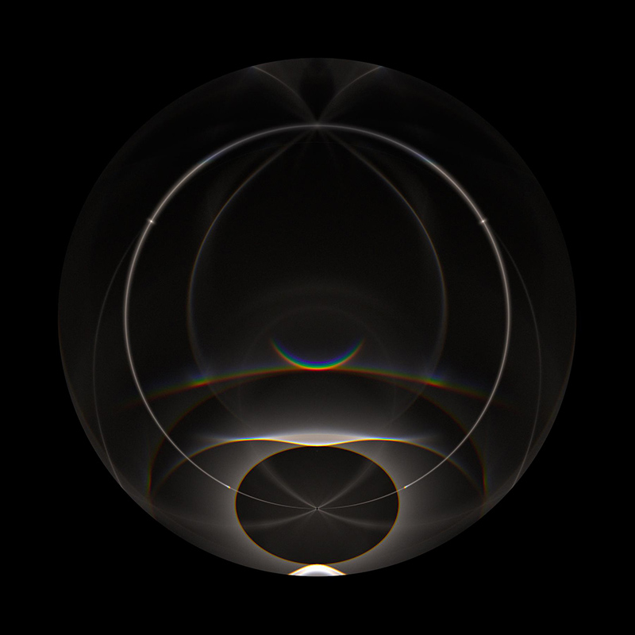

# Matlab codes

For simulation, you can start from `ray_tracing_main.m`. And there also
other codes for visualization data produced by c++ program.

*NOTE:* It is only a prototype for testing my algorithms. Later developing will be based on c++ codes.

## What can these codes do?

* It can do ray tracing with several specific ice crystal shape (see next section) and display the result.
* Arbitrary orientation of crystals, including uniform distributed in an angle range, uniform distributed on a sphere,
  Gaussian distributed with given mean and standard deviation.
* Multi-wave result visualization. It reads the binary file produced by C++ version and visulize the result.
  It depends on my another project [Spectrum Renderer](https://github.com/LoveDaisy/spec_render).
  
* Crystal shape visualization.

## Supported ice crystal shape.

* [Hexagonal prism/plate](https://www.atoptics.co.uk/halo/platcol.htm).
  Shape parameters are: `ratio = height / radii`.
* [Pyramidal](https://www.atoptics.co.uk/halo/crystpyr.htm).
  Shape parameters are: `ratios = [height1, height2, height3] / radii`,
  where heights are measured along c-axis, from top to bottom.

## TODO list

* Add more crystal shapes.
* Add custom crystal shapes. Maybe compact with `.obj` file format.
